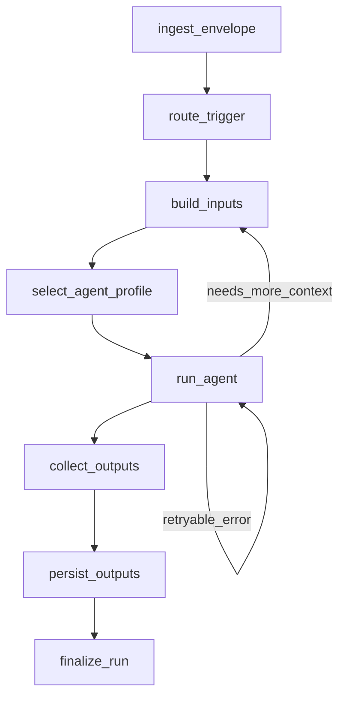

# Zoea Collab Refactor Plan (ExecutionRun + Channels + Docker-first)

Date: 2026-01-23

## Goals
- Align Zoea Collab to an LLM-as-control-plane architecture.
- Unify triggers, workflows, and agent execution into a single pipeline.
- Make channels first-class across all sources (chat, email, webhook, docs, schedule).
- Add docker-first agent isolation with guarded data access.
- Keep existing core where it fits, refactor overlapping/duplicative components.

## Key Decisions (Confirmed)
1. **Unify runs into ExecutionRun** (replace EventTriggerRun + WorkflowRun).
2. **Adopt LangGraph as orchestration runtime** (replace PocketFlow).
3. **Add Channel model** (first-class channels, external IDs, attachments, etc.).
4. **Docker-first sandbox** for agent isolation.

## Architectural Gaps / Overlaps to Resolve
- **Event vs Workflow execution duplication:** `events` directly runs SkillsAgentService while `workflows` has its own runner + WorkflowRun. These must converge.
- **No unified Trigger envelope:** each source defines its own payload shape; lacks channel/message abstraction.
- **Sandboxing is API-scoped only:** SkillExecutionHarness guards DB access, but no OS/process isolation.
- **Workflow AI gaps:** workflows only use ChatAgentService; no tool-agent, RAG, or router.
- **Output routing is fragmented:** conversation artifacts, workflow artifacts, and trigger artifacts are handled separately.
- **Skills vs tools vs workflows overlap:** SkillsAgentService inlines SKILL.md, while SkillLoaderTool exists as a tool; roles are blurred.

## Target Architecture (High-level)

Sources/Adapters -> TriggerEnvelope -> TriggerRouter -> ExecutionRun -> LangGraph Runtime -> AgentRuntime -> OutputAdapters

- **Sources/Adapters:** email, chat, docs, webhook, schedule.
- **TriggerEnvelope:** normalized, structured trigger payload.
- **TriggerRouter:** maps envelope to workflow/pattern/agent action.
- **ExecutionRun:** single run record for all executions.
- **LangGraph Runtime:** orchestrates agentic patterns via stateful graphs.
- **AgentRuntime:** local/docked/vm agent executor.
- **OutputAdapters:** send message, create document, call webhook, etc.

## Core Schema Changes

### 1) TriggerEnvelope (new)
A single, normalized input shape for all triggers.

Core fields:
- `trigger_type` (chat_message, email_received, doc_changed, webhook, scheduled)
- `source` { adapter, external_id, metadata }
- `channel` { channel_id, external_id, type, display_name }
- `payload` (message/body/metadata)
- `attachments` (files, links, document refs)
- `organization_id`, `project_id`, `workspace_id`

### 2) ExecutionRun (new unified model)
Replaces EventTriggerRun + WorkflowRun.

Fields (minimum):
- `run_id`, `status`, `created_at`, `started_at`, `completed_at`, `error`
- `organization`, `project`, `workspace`, `channel`
- `trigger_type`, `trigger_source` (adapter + external ids)
- `input_envelope` (TriggerEnvelope JSON)
- `pattern_id` or `graph_id`
- `agent_profile` (model/tools/skills/runtime)
- `outputs` (ExecutionOutput list)
- `telemetry` (token usage, audit log)
- `artifacts` (DocumentCollection)

### 3) Channel + ChannelMessage (new)
First-class channel abstraction for any source.

Channel:
- `organization`, `project`, `workspace`
- `adapter_type` (slack, discord, email, zoea_chat)
- `external_id`
- `display_name`, `metadata`

ChannelMessage:
- `channel`, `external_id`, `sender`, `role`
- `content`, `raw_content`
- `attachments`, `metadata`

Notes:
- Existing Conversation/Message can be folded into Channel for internal chat.
- If preserved, Conversation should reference Channel.

## Execution Pipeline (Refactor)

### Step 1: Ingest
Adapter produces TriggerEnvelope.

### Step 2: Router
TriggerRouter matches envelope to a TriggerDefinition.

TriggerDefinition =>
- `type`: workflow | pattern | agent | webhook
- `pattern_id` or `workflow_slug`
- `agent_profile`: skills/tools/model/runtime
- `output_routes`: message/doc/webhook
- `input_mapping`: envelope => workflow inputs

### Step 3: ExecutionRun
Router creates ExecutionRun and enqueues LangGraph execution.

### Step 4: LangGraph Runtime
LangGraph graphs encode agentic patterns:
- Sequence
- Plan-Execute
- Map-Reduce
- ReAct (tool use)
- Critic/Refiner
- Router/Handoff

### Step 5: AgentRuntime
- Local runtime for current smolagents
- Docker-first runtime for isolation
- Future: tmux, VM

### Step 6: OutputAdapters
- Message (Slack/Discord/email)
- Document creation
- Webhook
- Artifacts collection

## Orchestration Decision (LangGraph)
LangGraph becomes the canonical orchestration runtime. It provides stateful graphs, persistence hooks, and controlled looping, while allowing Zoea to keep its tool ecosystem and execution record (ExecutionRun).

Fallback/alternatives if LangGraph becomes a constraint:
1) Internal pattern engine aligned to agentic-patterns.com
2) AutoGen / MS Agent Framework (multi-agent focus, evolving)
3) LlamaIndex Workflows (KB-first)
4) CrewAI (task pipelines)

## Concrete LangGraph State Schema (Draft)
Use a TypedDict/Pydantic-compatible state contract so graph nodes remain pure functions over state.

```python
# langgraph/state.py (draft)
from typing import TypedDict, NotRequired, Literal, Any

TriggerType = Literal[
    "chat_message", "email_received", "doc_changed", "webhook", "scheduled"
]

class TriggerEnvelope(TypedDict):
    trigger_type: TriggerType
    source: dict[str, Any]          # {adapter, external_id, metadata}
    channel: NotRequired[dict[str, Any]]  # {channel_id, external_id, type, display_name}
    payload: dict[str, Any]         # normalized message/body/metadata
    attachments: list[dict[str, Any]]
    organization_id: int
    project_id: NotRequired[int]
    workspace_id: NotRequired[int]

class AgentProfile(TypedDict, total=False):
    provider: str
    model_id: str
    tools: list[str]
    skills: list[str]
    runtime: str               # "local" | "docker" | "tmux" | "vm"
    max_steps: int
    instructions: str
    router: str                # optional agent router name

class ExecutionOutput(TypedDict, total=False):
    kind: Literal["message", "document", "artifact", "webhook"]
    target: dict[str, Any]     # channel/doc/webhook target
    payload: dict[str, Any]
    metadata: dict[str, Any]

class ExecutionState(TypedDict, total=False):
    # Identity + persistence
    run_id: str
    execution_run_id: int
    status: str

    # Inputs
    envelope: TriggerEnvelope
    input_map: dict[str, Any]       # envelope -> workflow inputs
    inputs: dict[str, Any]

    # Routing / orchestration
    graph_id: str
    agent_profile: AgentProfile

    # Outputs
    outputs: list[ExecutionOutput]
    artifacts: list[dict[str, Any]] # artifact refs

    # Control + telemetry
    steps: list[dict[str, Any]]
    telemetry: dict[str, Any]
    error: str
    should_continue: bool
```

## LangGraph Node Layout (Draft)
Graph layout for a standard trigger->agent->outputs flow with optional loops:



Node responsibilities:
- `ingest_envelope`: normalize source payload into TriggerEnvelope.
- `route_trigger`: select graph_id + TriggerDefinition.
- `build_inputs`: map envelope -> workflow inputs.
- `select_agent_profile`: decide tools/skills/model/runtime (project + trigger config).
- `run_agent`: invoke AgentRuntime (local or docker).
- `collect_outputs`: translate agent artifacts into ExecutionOutputs.
- `persist_outputs`: write documents, messages, webhooks.
- `finalize_run`: mark ExecutionRun complete, persist telemetry.

## Migration Plan: PocketFlow -> LangGraph

### Phase A: Parallel runtime scaffold
- Add `langgraph` dependency in `packages/zoea-core/pyproject.toml`.
- Introduce `langgraph_runtime/` (new module) with `build_graph(graph_id)` + shared node helpers.
- Create `ExecutionState` and `TriggerEnvelope` schema module.
- Keep PocketFlow temporarily for existing workflows.

### Phase B: Replace workflow runner
- Replace `workflows/runner.py` with `execution/runner.py` that builds and runs LangGraph graphs.
- Update `WorkflowRegistry` to store `graph_id` and `graph_builder` instead of PocketFlow flow builder.
- Update CLI (`zoea workflows run`) to target `graph_id` and build `TriggerEnvelope` for CLI input.

### Phase C: Port built-in workflows
- Convert `workflows/builtin/*/flow.py` to LangGraph graphs.
- Reuse existing node logic as graph nodes (plain functions) where possible.
- Remove PocketFlow dependency and flow-specific tests; replace with graph-based tests.

### Phase D: Replace Event triggers
- Update `events/dispatcher.py` to create `ExecutionRun` and enqueue LangGraph.
- Replace `EventTriggerRun` with `ExecutionRun`.
- Update `events/tasks.py` to call `execution/runner.py` instead of `SkillsAgentService`.

### Phase E: Deprecation cleanup
- Remove PocketFlow from dependencies.
- Remove/retire `workflows/base_nodes.py`, `workflows/context.py` if unused.
- Update docs to reflect LangGraph.

## Implementation Phases (Updated)

## Implementation Phases

### Phase 1 - Schema + API foundations
- Add TriggerEnvelope schema + serialization utilities
- Add Channel + ChannelMessage models
- Add ExecutionRun model; migrate from EventTriggerRun + WorkflowRun
- Introduce TriggerDefinition mapping (old EventTrigger -> new TriggerDefinition)

### Phase 2 - LangGraph runtime + execution path
- Add LangGraph runtime module and shared node helpers
- Replace EventTrigger dispatch: now routes to ExecutionRun + LangGraph
- Replace workflow runner to run LangGraph graphs
- Consolidate artifact handling into OutputAdapters

### Phase 3 - AgentRuntime + Docker
- Introduce AgentRuntime interface
- Implement Docker runtime: mount workspace, run agent in container
- Bind SkillExecutionHarness to runtime for scoped access

### Phase 4 - Outputs + Adapters
- OutputAdapters for Slack, Discord, email, webhook
- Scheduled triggers (mom-style event scheduling)
- Webhook ingress trigger
- Notion doc-change example (webhook)

### Phase 5 - Cleanup + Docs
- Deprecate or fold Conversation model if needed
- Update CLI and docs to reflect ExecutionRun
- Add end-to-end tests for trigger->run->outputs

## Open Questions to Resolve Next
- Keep PocketFlow in parallel for one release, or cut over immediately?
- Should Channel store full transcript in DB or also support log.jsonl (hybrid)?
- What tool/skill constraints should the docker runtime enforce beyond harness?
