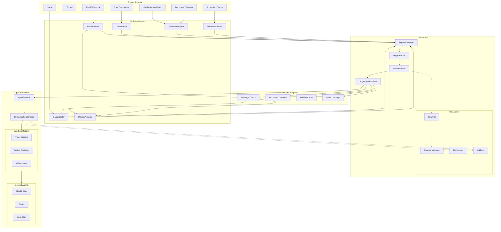
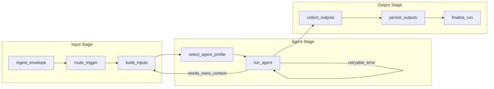
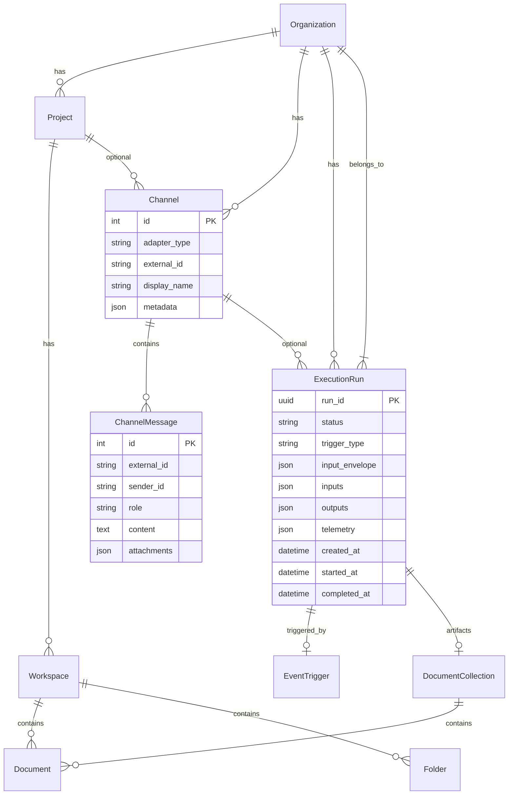
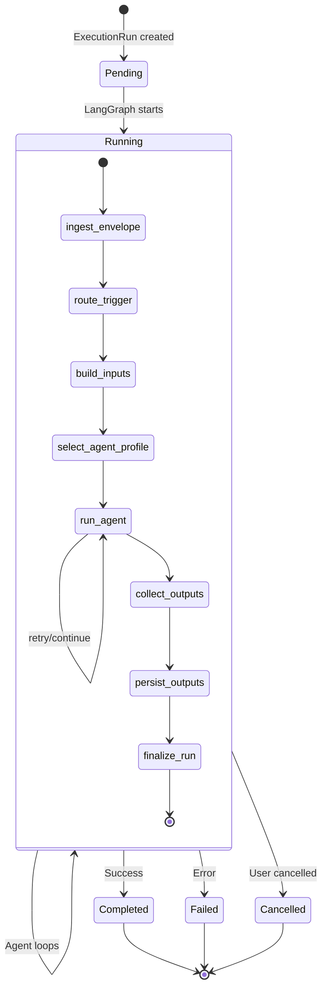
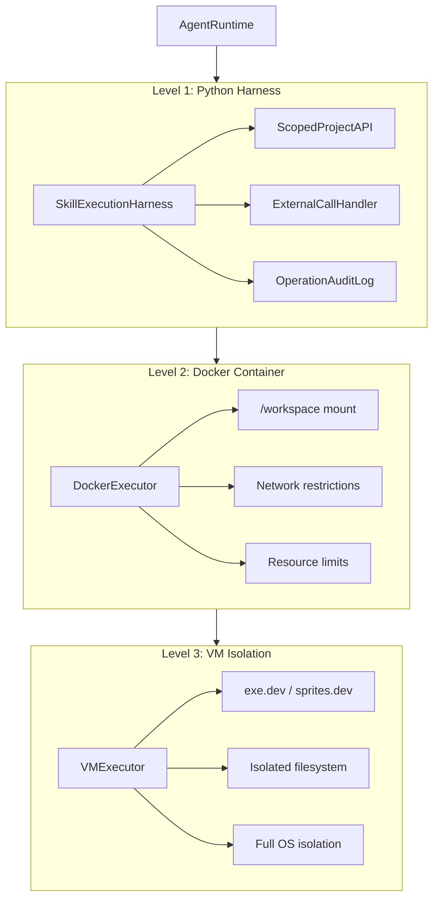
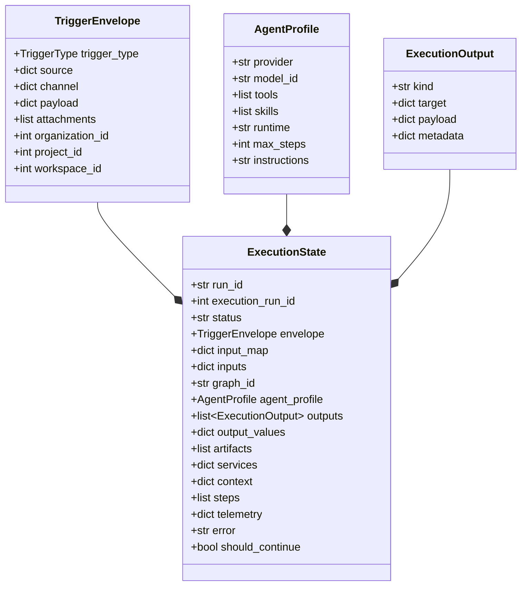

# Zoea Collab Core Architecture

## High-Level Flow

```mermaid
flowchart TB
    subgraph Sources["Trigger Sources"]
        EMAIL[Email/Webhook]
        CHAT[Zoea Studio Chat]
        SLACK[Slack]
        DISCORD[Discord]
        WEBHOOK[n8n/Zapier Webhook]
        SCHEDULE[Scheduled Events]
        DOC[Document Changes]
    end

    subgraph Adapters["Platform Adapters"]
        EA[EmailAdapter]
        CA[ChatAdapter]
        SA[SlackAdapter]
        DA[DiscordAdapter]
        WA[WebhookAdapter]
        SCA[ScheduleAdapter]
    end

    subgraph Core["Zoea Core"]
        TE[TriggerEnvelope]
        TR[TriggerRouter]
        ER[ExecutionRun]
        LG[LangGraph Runtime]

        subgraph Data["Data Layer"]
            CH[Channel]
            CM[ChannelMessage]
            DOC_MODEL[Documents]
            ART[Artifacts]
        end
    end

    subgraph Agent["Agent Execution"]
        AR[AgentRuntime]
        HARNESS[SkillExecutionHarness]

        subgraph Sandboxes["Sandbox Options"]
            TMUX[Tmux Session]
            DOCKER[Docker Container]
            VM[VM - exe.dev]
        end

        subgraph ExternalAgents["External Agents"]
            CLAUDE[Claude Code]
            CODEX[Codex]
            OPENCODE[OpenCode]
        end
    end

    subgraph Outputs["Output Adapters"]
        MSG_OUT[Message Output]
        DOC_OUT[Document Creation]
        WEBHOOK_OUT[Webhook Call]
        ART_OUT[Artifact Storage]
    end

    %% Source to Adapter connections
    EMAIL --> EA
    CHAT --> CA
    SLACK --> SA
    DISCORD --> DA
    WEBHOOK --> WA
    SCHEDULE --> SCA
    DOC --> WA

    %% Adapter to Core
    EA --> TE
    CA --> TE
    SA --> TE
    DA --> TE
    WA --> TE
    SCA --> TE

    %% Core flow
    TE --> TR
    TR --> ER
    ER --> LG
    ER -.-> CH
    CH -.-> CM

    %% LangGraph to Agent
    LG --> AR
    AR --> HARNESS
    HARNESS --> Sandboxes
    Sandboxes --> ExternalAgents

    %% Agent to Data
    HARNESS -.-> DOC_MODEL
    HARNESS -.-> ART

    %% LangGraph to Outputs
    LG --> MSG_OUT
    LG --> DOC_OUT
    LG --> WEBHOOK_OUT
    LG --> ART_OUT

    %% Output back to platforms
    MSG_OUT --> SA
    MSG_OUT --> DA
    MSG_OUT --> EA
```

## LangGraph Execution Flow

```mermaid
flowchart LR
    subgraph Input["Input Stage"]
        IE[ingest_envelope]
        RT[route_trigger]
        BI[build_inputs]
    end

    subgraph Agent["Agent Stage"]
        SAP[select_agent_profile]
        RA[run_agent]
    end

    subgraph Output["Output Stage"]
        CO[collect_outputs]
        PO[persist_outputs]
        FR[finalize_run]
    end

    IE --> RT --> BI --> SAP --> RA
    RA -->|needs_more_context| BI
    RA -->|retryable_error| RA
    RA --> CO --> PO --> FR
```

## Data Model Relationships

```mermaid
erDiagram
    Organization ||--o{ Project : has
    Organization ||--o{ Channel : has
    Organization ||--o{ ExecutionRun : has

    Project ||--o{ Workspace : has
    Project ||--o{ Channel : "optional"

    Channel ||--o{ ChannelMessage : contains
    Channel ||--o{ ExecutionRun : "optional"

    ExecutionRun ||--o| EventTrigger : "triggered_by"
    ExecutionRun ||--o| DocumentCollection : artifacts
    ExecutionRun }|--|| Organization : belongs_to

    Workspace ||--o{ Document : contains
    Workspace ||--o{ Folder : contains

    DocumentCollection ||--o{ Document : contains

    ExecutionRun {
        uuid run_id PK
        string status
        string trigger_type
        json input_envelope
        json inputs
        json outputs
        json telemetry
        datetime created_at
        datetime started_at
        datetime completed_at
    }

    Channel {
        int id PK
        string adapter_type
        string external_id
        string display_name
        json metadata
    }

    ChannelMessage {
        int id PK
        string external_id
        string sender_id
        string role
        text content
        json attachments
    }
```

## Execution State Flow

```mermaid
stateDiagram-v2
    [*] --> Pending: ExecutionRun created
    Pending --> Running: LangGraph starts
    Running --> Running: Agent loops
    Running --> Completed: Success
    Running --> Failed: Error
    Running --> Cancelled: User cancelled
    Completed --> [*]
    Failed --> [*]
    Cancelled --> [*]

    state Running {
        [*] --> ingest_envelope
        ingest_envelope --> route_trigger
        route_trigger --> build_inputs
        build_inputs --> select_agent_profile
        select_agent_profile --> run_agent
        run_agent --> run_agent: retry/continue
        run_agent --> collect_outputs
        collect_outputs --> persist_outputs
        persist_outputs --> finalize_run
        finalize_run --> [*]
    }
```

## Sandbox Isolation Levels

```mermaid
flowchart TB
    subgraph Level1["Level 1: Python Harness"]
        H1[SkillExecutionHarness]
        H1 --> SC1[ScopedProjectAPI]
        H1 --> EC1[ExternalCallHandler]
        H1 --> AL1[OperationAuditLog]
    end

    subgraph Level2["Level 2: Docker Container"]
        H2[DockerExecutor]
        H2 --> WS2["/workspace mount"]
        H2 --> NET2["Network restrictions"]
        H2 --> RES2["Resource limits"]
    end

    subgraph Level3["Level 3: VM Isolation"]
        H3[VMExecutor]
        H3 --> VM3["exe.dev / sprites.dev"]
        H3 --> FS3["Isolated filesystem"]
        H3 --> FULL3["Full OS isolation"]
    end

    Agent[AgentRuntime] --> Level1
    Level1 --> Level2
    Level2 --> Level3
```

## TriggerEnvelope Schema

```mermaid
classDiagram
    class TriggerEnvelope {
        +TriggerType trigger_type
        +dict source
        +dict channel
        +dict payload
        +list attachments
        +int organization_id
        +int project_id
        +int workspace_id
    }

    class ExecutionState {
        +str run_id
        +int execution_run_id
        +str status
        +TriggerEnvelope envelope
        +dict input_map
        +dict inputs
        +str graph_id
        +AgentProfile agent_profile
        +list~ExecutionOutput~ outputs
        +dict output_values
        +list artifacts
        +dict services
        +dict context
        +list steps
        +dict telemetry
        +str error
        +bool should_continue
    }

    class AgentProfile {
        +str provider
        +str model_id
        +list tools
        +list skills
        +str runtime
        +int max_steps
        +str instructions
    }

    class ExecutionOutput {
        +str kind
        +dict target
        +dict payload
        +dict metadata
    }

    TriggerEnvelope --* ExecutionState
    AgentProfile --* ExecutionState
    ExecutionOutput --* ExecutionState
```
