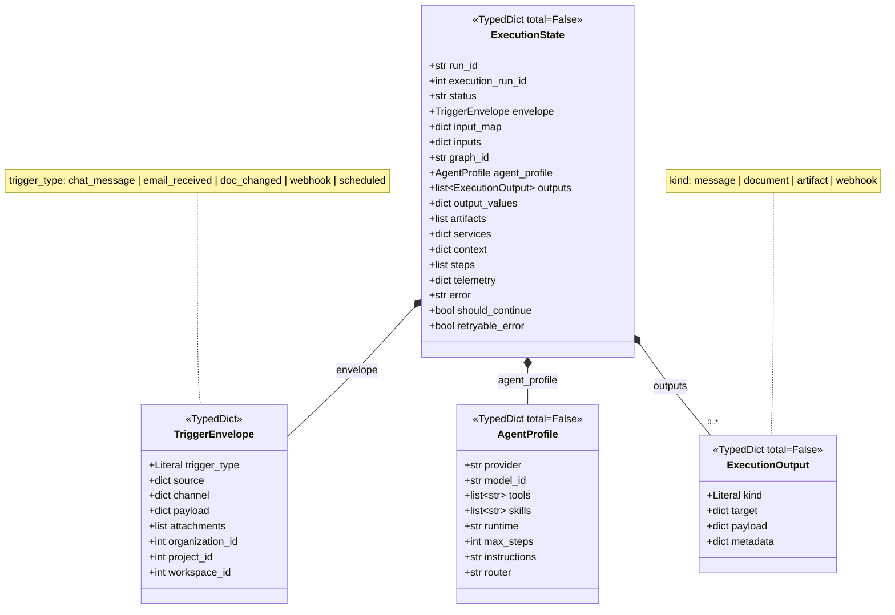

# Zoea Collab Data Schema

## Complete Entity Relationship Diagram

```mermaid
erDiagram
    %% Core Multi-Tenant Structure
    Organization ||--o{ Project : owns
    Organization ||--o{ Channel : owns
    Organization ||--o{ ExecutionRun : owns
    Organization ||--o{ EventTrigger : owns
    Organization ||--o{ Document : owns
    Organization ||--o{ Conversation : owns

    %% Project Hierarchy
    Project ||--o{ Workspace : contains
    Project ||--o{ Channel : "scopes (optional)"
    Project ||--o{ ExecutionRun : "scopes (optional)"
    Project ||--o{ Source : has

    %% Workspace & Documents
    Workspace ||--o{ Folder : contains
    Workspace ||--o{ Document : contains
    Workspace ||--o{ Channel : "scopes (optional)"
    Folder ||--o{ Folder : "parent (MPTT)"
    Folder ||--o{ Document : contains

    %% Channel System (NEW)
    Channel ||--o{ ChannelMessage : contains
    Channel ||--o{ ExecutionRun : "context (optional)"

    %% Execution System (NEW - Unified)
    ExecutionRun ||--o| EventTrigger : "triggered_by (optional)"
    ExecutionRun ||--o| Channel : "context (optional)"
    ExecutionRun ||--o| DocumentCollection : artifacts

    %% Event Triggers
    EventTrigger ||--o{ ExecutionRun : triggers

    %% Documents & Collections
    DocumentCollection ||--o{ DocumentCollectionItem : contains
    DocumentCollectionItem }o--|| Document : references

    %% Conversations (Legacy - may fold into Channel)
    Conversation ||--o{ Message : contains
    Conversation ||--o| DocumentCollection : artifacts

    %% ============================================
    %% Entity Definitions
    %% ============================================

    Organization {
        int id PK
        string name
        string slug UK
        datetime created_at
    }

    Project {
        int id PK
        int organization_id FK
        string name
        string slug
        string working_directory
        string llm_provider
        string llm_model_id
        string gemini_store_id
        string canonical_email
        datetime created_at
    }

    Workspace {
        int id PK
        int organization_id FK
        int project_id FK
        int parent_id FK "MPTT self-ref"
        string name
        string slug
        int lft "MPTT"
        int rght "MPTT"
        int tree_id "MPTT"
        int level "MPTT"
    }

    Channel {
        int id PK
        int organization_id FK
        int project_id FK "nullable"
        int workspace_id FK "nullable"
        string adapter_type "slack|discord|email|zoea_chat"
        string external_id
        string display_name
        json metadata
        datetime created_at
        datetime updated_at
    }

    ChannelMessage {
        int id PK
        int organization_id FK
        int channel_id FK
        string external_id
        string sender_id
        string sender_name
        string role "user|assistant|system"
        text content
        text raw_content
        json attachments
        json metadata
        datetime created_at
    }

    ExecutionRun {
        int id PK
        string run_id UK "uuid"
        int organization_id FK
        int project_id FK "nullable"
        int workspace_id FK "nullable"
        int channel_id FK "nullable"
        int trigger_id FK "nullable"
        string trigger_type
        string source_type
        int source_id "nullable"
        string workflow_slug "nullable"
        string graph_id "nullable"
        string status "pending|running|completed|failed|cancelled"
        json input_envelope
        json inputs
        json outputs "nullable"
        text error "nullable"
        json telemetry "nullable"
        string provider_model "nullable"
        json token_usage "nullable"
        string task_id "nullable"
        int artifacts_id FK "nullable"
        int created_by_id FK "nullable"
        datetime created_at
        datetime updated_at
        datetime started_at "nullable"
        datetime completed_at "nullable"
    }

    EventTrigger {
        int id PK
        int organization_id FK
        int project_id FK "nullable"
        string event_type
        json skills "list of skill names"
        boolean is_enabled
        boolean run_async
        json filters "nullable"
        json agent_config "nullable"
        int created_by_id FK "nullable"
        datetime created_at
    }

    Document {
        int id PK
        int organization_id FK
        int project_id FK "nullable"
        int workspace_id FK "nullable"
        int folder_id FK "nullable"
        string name
        text description
        string doc_type "discriminator"
        datetime created_at
        datetime updated_at
    }

    Folder {
        int id PK
        int organization_id FK
        int project_id FK "nullable"
        int workspace_id FK "nullable"
        int parent_id FK "MPTT self-ref"
        string name
        boolean is_system
        int lft "MPTT"
        int rght "MPTT"
        int tree_id "MPTT"
        int level "MPTT"
    }

    DocumentCollection {
        int id PK
        int organization_id FK
        int workspace_id FK "nullable"
        string collection_type "artifact|clipboard|selection"
        string name
        text description
        int created_by_id FK "nullable"
        datetime created_at
    }

    DocumentCollectionItem {
        int id PK
        int collection_id FK
        int content_type_id FK "generic FK"
        string object_id "generic FK"
        int position
        string direction_added
        string source_channel
        json source_metadata
        datetime created_at
    }

    Conversation {
        int id PK
        int organization_id FK
        int project_id FK "nullable"
        int workspace_id FK "nullable"
        string agent_name
        string title
        int artifacts_id FK "nullable"
        int created_by_id FK "nullable"
        datetime created_at
    }

    Message {
        int id PK
        int conversation_id FK
        string role "user|assistant|system"
        text content
        json tool_calls "nullable"
        json metadata "nullable"
        datetime created_at
    }

    Source {
        int id PK
        int organization_id FK
        int project_id FK "nullable"
        string source_type "local|s3|r2"
        string name
        text description
        json config
        boolean is_active
        int created_by_id FK "nullable"
        datetime created_at
    }
```



## Document Type Hierarchy (Multi-Table Inheritance)

```mermaid
erDiagram
    Document ||--o| TextDocument : "inherits"
    Document ||--o| Image : "inherits"
    Document ||--o| PDF : "inherits"
    Document ||--o| FileDocument : "inherits"

    TextDocument ||--o| Markdown : "inherits"
    TextDocument ||--o| CSV : "inherits"
    TextDocument ||--o| JSONCanvas : "inherits"
    TextDocument ||--o| YooptaDocument : "inherits"
    TextDocument ||--o| Diagram : "inherits (abstract)"

    Diagram ||--o| D2Diagram : "inherits"
    Diagram ||--o| MermaidDiagram : "inherits"
    Diagram ||--o| ReactFlowDiagram : "inherits"
    Diagram ||--o| ExcalidrawDiagram : "inherits"

    Document {
        int id PK
        string name
        text description
        string doc_type "discriminator"
    }

    TextDocument {
        int document_ptr_id PK_FK
        text content
    }

    Image {
        int document_ptr_id PK_FK
        string file "ImageField"
        string caption
        int width
        int height
    }

    PDF {
        int document_ptr_id PK_FK
        string file "FileField"
        int page_count
    }

    FileDocument {
        int document_ptr_id PK_FK
        string file "FileField"
        string mime_type
    }

    Markdown {
        int textdocument_ptr_id PK_FK
    }

    YooptaDocument {
        int textdocument_ptr_id PK_FK
        json yoopta_content
    }

    Diagram {
        int textdocument_ptr_id PK_FK
        string diagram_type
    }
```

## LangGraph State Schema



## Key Indexes

| Model | Index Fields | Purpose |
|-------|--------------|---------|
| ExecutionRun | `(organization, status)` | Filter runs by status |
| ExecutionRun | `(organization, trigger_type)` | Filter by trigger type |
| ExecutionRun | `(workflow_slug, created_at)` | Workflow run history |
| ExecutionRun | `(source_type, source_id)` | Find runs by source |
| Channel | `(organization, adapter_type)` | List channels by platform |
| Channel | `(organization, external_id)` | Lookup by external ID |
| ChannelMessage | `(channel, created_at)` | Message timeline |
| ChannelMessage | `(sender_id, created_at)` | Messages by sender |

## Unique Constraints

| Model | Fields | Purpose |
|-------|--------|---------|
| ExecutionRun | `run_id` | Global run identifier |
| Channel | `(organization, adapter_type, external_id)` | No duplicate channels |
| Project | `(organization, slug)` | Unique project slugs per org |
| Workspace | `(project, slug)` | Unique workspace slugs per project |
