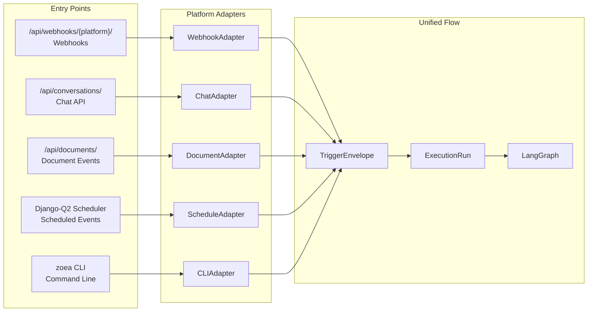
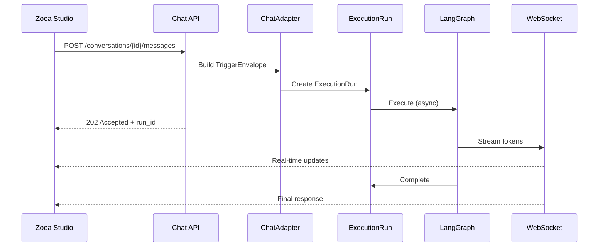
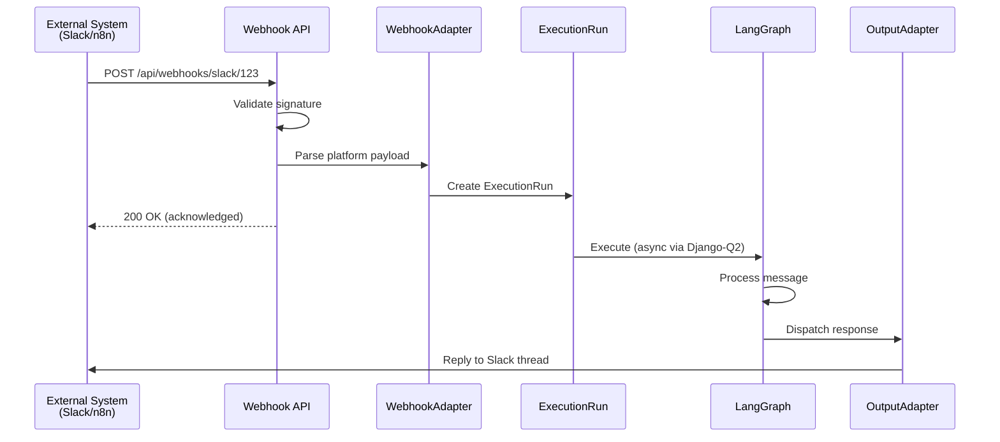
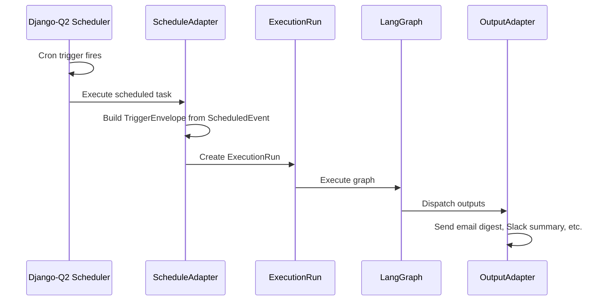
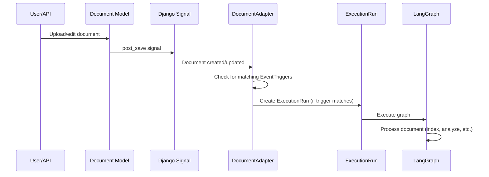

# Entry Points and Platform Adapters

## Overview

Zoea Collab has **multiple entry points** that all normalize to the same internal execution flow. The webhook is one entry point, optimized for external integrations, but interactive applications like Zoea Studio use the Chat API instead.

**Key principle:** Different entry points, unified internal flow.

---

## Architecture



---

## Entry Points Comparison

| Entry Point | API/Trigger | Use Case | Characteristics |
|-------------|-------------|----------|-----------------|
| **Webhook API** | `POST /api/webhooks/{platform}/{connection_id}` | Slack, Discord, n8n, Zapier | Async, fire-and-forget, signature validation |
| **Chat API** | `POST /api/conversations/{id}/messages` | Zoea Studio, web apps | Sync/streaming, WebSocket, real-time responses |
| **Document Events** | Django signals on Document save | File uploads, edits | Internal triggers, no external caller |
| **Scheduled Events** | Django-Q2 cron/one-shot | Daily digests, periodic tasks | No external caller, time-based |
| **CLI** | `zoea workflows run`, `zoea agents run` | Developers, scripts, CI/CD | Direct invocation, blocking |

---

## Chat API Flow (Interactive Applications)

The Chat API is optimized for interactive use with real-time streaming:



**Key characteristics:**
- Returns immediately with `run_id` (doesn't block waiting for completion)
- Streams response tokens via WebSocket
- User session context available (authenticated user)
- Conversation history accessible for context
- Optimized for low-latency interactive use

---

## Webhook Flow (External Integrations)

The Webhook API is optimized for external push-based integrations:



**Key characteristics:**
- Validates webhook signatures (HMAC, etc.)
- Returns 200 OK quickly to avoid timeout
- No streaming (response sent later via OutputAdapter)
- Platform-specific payload parsing
- Replies asynchronously to original platform

---

## Scheduled Events Flow

Scheduled events are triggered by Django-Q2 without an external caller:



---

## Document Events Flow

Document events are triggered internally by Django signals:



---

## Unified TriggerEnvelope

All entry points produce the same `TriggerEnvelope` structure:

### From Chat API (Zoea Studio)
```python
TriggerEnvelope(
    trigger_type="chat_message",
    source={
        "adapter": "zoea_chat",
        "external_id": "conv_123",
        "metadata": {"session_id": "sess_abc"}
    },
    channel={
        "channel_id": 42,
        "external_id": "conv_123",
        "type": "zoea_conversation",
        "display_name": "Project Discussion"
    },
    payload={
        "text": "Analyze this quarterly report",
        "user_id": 5,
        "user_name": "alice@example.com"
    },
    attachments=[
        {
            "type": "file",
            "filename": "Q4-report.pdf",
            "document_id": 789,
            "mime_type": "application/pdf"
        }
    ],
    organization_id=1,
    project_id=5,
    workspace_id=12,
)
```

### From Webhook (Slack)
```python
TriggerEnvelope(
    trigger_type="webhook",
    source={
        "adapter": "slack",
        "external_id": "evt_abc123",
        "metadata": {"team_id": "T12345", "event_type": "message"}
    },
    channel={
        "channel_id": None,  # Will be created/matched
        "external_id": "C98765",
        "type": "slack_channel",
        "display_name": "#general"
    },
    payload={
        "text": "Analyze this quarterly report",
        "sender_id": "U12345",
        "sender_name": "alice",
        "thread_ts": "1706012345.000100"
    },
    attachments=[
        {
            "type": "file",
            "filename": "Q4-report.pdf",
            "url": "https://files.slack.com/...",
            "mime_type": "application/pdf"
        }
    ],
    organization_id=1,
    project_id=5,
    workspace_id=None,
)
```

### From Scheduled Event
```python
TriggerEnvelope(
    trigger_type="scheduled",
    source={
        "adapter": "scheduler",
        "external_id": "sched_daily_digest",
        "metadata": {"cron": "0 9 * * 1-5", "timezone": "America/New_York"}
    },
    channel=None,  # No channel context
    payload={
        "scheduled_event_id": 15,
        "scheduled_at": "2026-01-22T09:00:00-05:00",
        "event_data": {"report_type": "daily_summary"}
    },
    attachments=[],
    organization_id=1,
    project_id=5,
    workspace_id=None,
)
```

---

## When to Use Which Entry Point

| Scenario | Recommended Entry Point | Reason |
|----------|------------------------|--------|
| Building a chat UI for end users | **Chat API** | Real-time streaming, conversation context |
| Slack bot responding to messages | **Webhook** | Slack Events API pushes to webhook |
| Discord bot integration | **Webhook** | Discord sends events to webhook |
| n8n/Zapier automation workflow | **Webhook** | Generic webhook trigger |
| Daily email digest | **Scheduled Event** | Time-based, no external caller |
| Weekly report generation | **Scheduled Event** | Cron-based trigger |
| Document upload triggers analysis | **Document Event** | Internal Django signal |
| Developer testing a workflow | **CLI** | Direct invocation, see output |
| CI/CD pipeline integration | **CLI** or **Webhook** | Depends on CI system |
| Mobile app chat feature | **Chat API** | Same as web, needs streaming |

---

## API Endpoints Summary

### Chat API
```
POST   /api/conversations/                    # Create conversation
GET    /api/conversations/{id}/               # Get conversation
POST   /api/conversations/{id}/messages/      # Send message (returns run_id)
GET    /api/conversations/{id}/messages/      # List messages
WS     /api/conversations/{id}/stream/        # WebSocket for streaming
```

### Webhook API
```
POST   /api/webhooks/{platform}/{connection_id}/   # Receive webhook
GET    /api/connections/                           # List platform connections
POST   /api/connections/                           # Create connection
DELETE /api/connections/{id}/                      # Remove connection
```

### Execution API (shared)
```
GET    /api/runs/                             # List ExecutionRuns
GET    /api/runs/{run_id}/                    # Get run details
GET    /api/runs/{run_id}/artifacts/          # Get run artifacts
POST   /api/runs/{run_id}/cancel/             # Cancel running execution
```

---

## Platform Adapter Interface

All adapters implement the same interface:

```python
class BasePlatformAdapter(ABC):
    """Abstract base for platform adapters."""

    @abstractmethod
    def parse_inbound(self, raw_payload: dict, headers: dict) -> TriggerEnvelope:
        """Parse platform-specific payload into TriggerEnvelope."""
        ...

    @abstractmethod
    def validate_request(self, request: HttpRequest) -> bool:
        """Validate webhook signature or authentication."""
        ...

    @abstractmethod
    async def send_message(
        self,
        channel_id: str,
        content: str,
        attachments: list = None,
        **kwargs
    ) -> dict:
        """Send message back to platform."""
        ...

    @abstractmethod
    def download_attachment(self, attachment: dict) -> Path:
        """Download attachment to local storage."""
        ...
```

### Implementations

| Adapter | Platform | Inbound | Outbound |
|---------|----------|---------|----------|
| `SlackAdapter` | Slack | Events API webhook | Web API |
| `DiscordAdapter` | Discord | Gateway/webhook | Bot API |
| `EmailAdapter` | Email (Mailgun) | Inbound webhook | SMTP/API |
| `WebhookAdapter` | Generic (n8n, Zapier) | POST payload | Webhook callback |
| `ChatAdapter` | Zoea Studio | HTTP POST | WebSocket |
| `ScheduleAdapter` | Internal | Django-Q2 | N/A |
| `DocumentAdapter` | Internal | Django signals | N/A |

---

## Summary

1. **Multiple entry points** exist, each optimized for its use case
2. **Platform adapters** normalize each entry point's payload to `TriggerEnvelope`
3. **Unified internal flow**: `TriggerEnvelope` → `ExecutionRun` → `LangGraph` → `OutputAdapters`
4. **Chat API** for interactive applications (streaming, WebSocket)
5. **Webhook API** for external push-based integrations (Slack, Discord, n8n)
6. **Scheduled Events** for time-based triggers (cron, one-shot)
7. **Document Events** for internal file-based triggers
8. **CLI** for developer/script access
