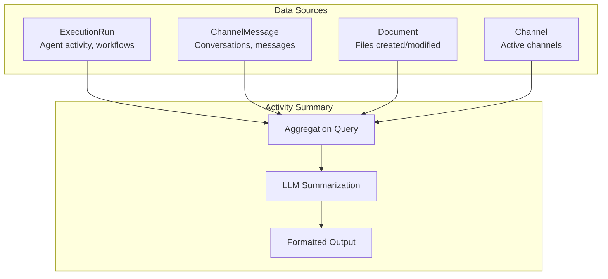
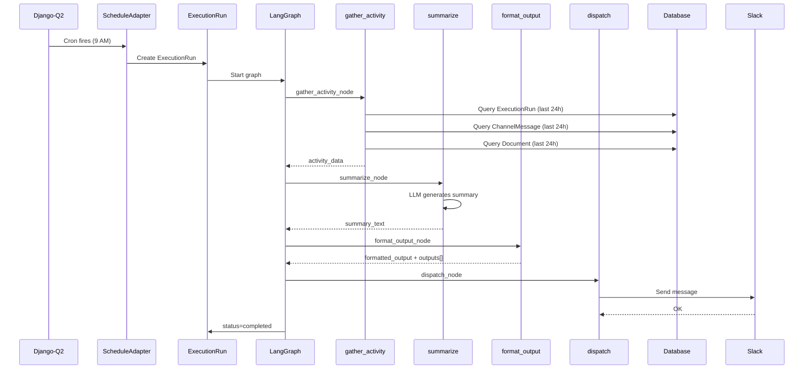
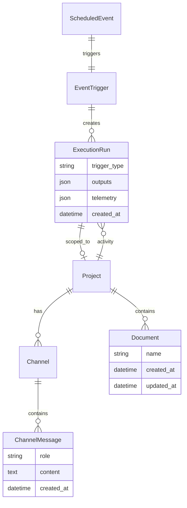

# Scheduled Project Activity Summary

## Overview

A scheduled event that generates a summary of recent project activity, delivered via email or Slack.

---

## Data Sources for Project Activity

`ExecutionRun` is the **central source for agent/workflow activity**, but a comprehensive project summary pulls from multiple models:



| Model | Activity Data |
|-------|---------------|
| **ExecutionRun** | Workflows run, agent invocations, success/failure rates, token usage |
| **ChannelMessage** | Messages exchanged, active conversations, user participation |
| **Document** | Files created, modified, document types |
| **Channel** | Active channels, new channels created |

---

## Implementation

### 1. ScheduledEvent Configuration

```python
# Created via API or admin
ScheduledEvent.objects.create(
    organization_id=1,
    project_id=5,
    name="Daily Activity Summary",
    event_type="cron",
    cron_expression="0 9 * * 1-5",  # 9 AM weekdays
    timezone="America/New_York",
    trigger=EventTrigger.objects.get(slug="project-activity-summary"),
    event_data={
        "lookback_hours": 24,
        "include_metrics": True,
        "output_channel": "slack",
        "slack_channel_id": "C98765",
    },
    is_enabled=True,
)
```

### 2. EventTrigger Configuration

```python
EventTrigger.objects.create(
    organization_id=1,
    project_id=5,
    event_type="scheduled",
    skills=["project_activity_summary"],
    is_enabled=True,
    agent_config={
        "provider": "openai",
        "model_id": "gpt-4o-mini",
        "max_steps": 5,
    },
)
```

### 3. LangGraph Workflow

```python
# workflows/builtin/project_activity_summary/graph.py

from langgraph.graph import StateGraph, END
from langgraph_runtime.state import ExecutionState

def build_graph():
    graph = StateGraph(ExecutionState)

    graph.add_node("gather_activity", gather_activity_node)
    graph.add_node("summarize", summarize_node)
    graph.add_node("format_output", format_output_node)
    graph.add_node("dispatch", dispatch_node)

    graph.add_edge("gather_activity", "summarize")
    graph.add_edge("summarize", "format_output")
    graph.add_edge("format_output", "dispatch")
    graph.add_edge("dispatch", END)

    graph.set_entry_point("gather_activity")

    return graph
```

### 4. Node Implementations

#### gather_activity_node

```python
from datetime import datetime, timedelta
from django.db.models import Count, Sum, Avg
from django.utils import timezone

from execution.models import ExecutionRun
from channels.models import ChannelMessage
from documents.models import Document

async def gather_activity_node(state: ExecutionState) -> ExecutionState:
    """Query recent activity from all relevant models."""

    ctx = state.get("context", {})
    org_id = ctx.get("organization_id")
    project_id = ctx.get("project_id")
    event_data = state.get("envelope", {}).get("payload", {}).get("event_data", {})

    lookback_hours = event_data.get("lookback_hours", 24)
    since = timezone.now() - timedelta(hours=lookback_hours)

    # --- ExecutionRun activity ---
    runs = ExecutionRun.objects.filter(
        organization_id=org_id,
        project_id=project_id,
        created_at__gte=since,
    )

    run_stats = runs.aggregate(
        total=Count("id"),
        completed=Count("id", filter=Q(status="completed")),
        failed=Count("id", filter=Q(status="failed")),
        total_tokens=Sum("token_usage__total"),
        avg_duration=Avg("duration_seconds"),
    )

    runs_by_type = list(
        runs.values("trigger_type")
        .annotate(count=Count("id"))
        .order_by("-count")
    )

    runs_by_workflow = list(
        runs.exclude(workflow_slug__isnull=True)
        .values("workflow_slug")
        .annotate(count=Count("id"))
        .order_by("-count")[:5]
    )

    # --- ChannelMessage activity ---
    messages = ChannelMessage.objects.filter(
        organization_id=org_id,
        channel__project_id=project_id,
        created_at__gte=since,
    )

    message_stats = messages.aggregate(
        total=Count("id"),
        user_messages=Count("id", filter=Q(role="user")),
        assistant_messages=Count("id", filter=Q(role="assistant")),
    )

    active_channels = list(
        messages.values("channel__display_name", "channel__adapter_type")
        .annotate(count=Count("id"))
        .order_by("-count")[:5]
    )

    # --- Document activity ---
    docs_created = Document.objects.filter(
        organization_id=org_id,
        project_id=project_id,
        created_at__gte=since,
    )

    docs_modified = Document.objects.filter(
        organization_id=org_id,
        project_id=project_id,
        updated_at__gte=since,
        created_at__lt=since,  # Modified, not created
    )

    doc_stats = {
        "created": docs_created.count(),
        "modified": docs_modified.count(),
        "by_type": list(
            docs_created.values("doc_type")
            .annotate(count=Count("id"))
            .order_by("-count")
        ),
    }

    # Store in state
    state["activity_data"] = {
        "period": {
            "since": since.isoformat(),
            "until": timezone.now().isoformat(),
            "hours": lookback_hours,
        },
        "executions": {
            "stats": run_stats,
            "by_trigger_type": runs_by_type,
            "by_workflow": runs_by_workflow,
        },
        "messages": {
            "stats": message_stats,
            "active_channels": active_channels,
        },
        "documents": doc_stats,
    }

    return state
```

#### summarize_node

```python
async def summarize_node(state: ExecutionState) -> ExecutionState:
    """Use LLM to generate human-readable summary."""

    activity = state.get("activity_data", {})
    services = state.get("services", {})
    ai_service = services.get("ai")

    prompt = f"""
    Summarize the following project activity data into a concise, human-readable summary.
    Focus on key highlights, trends, and any notable events.

    Activity Period: {activity['period']['hours']} hours

    ## Execution Activity
    - Total runs: {activity['executions']['stats']['total']}
    - Completed: {activity['executions']['stats']['completed']}
    - Failed: {activity['executions']['stats']['failed']}
    - By trigger type: {activity['executions']['by_trigger_type']}
    - Top workflows: {activity['executions']['by_workflow']}

    ## Messaging Activity
    - Total messages: {activity['messages']['stats']['total']}
    - User messages: {activity['messages']['stats']['user_messages']}
    - Assistant messages: {activity['messages']['stats']['assistant_messages']}
    - Active channels: {activity['messages']['active_channels']}

    ## Document Activity
    - Documents created: {activity['documents']['created']}
    - Documents modified: {activity['documents']['modified']}
    - By type: {activity['documents']['by_type']}

    Write a brief summary (3-5 paragraphs) highlighting:
    1. Overall activity level
    2. Most active areas (workflows, channels)
    3. Any concerns (failures, errors)
    4. Notable achievements
    """

    response = await ai_service.generate(prompt)

    state["summary_text"] = response.content
    return state
```

#### format_output_node

```python
async def format_output_node(state: ExecutionState) -> ExecutionState:
    """Format summary for output channel."""

    activity = state.get("activity_data", {})
    summary = state.get("summary_text", "")
    event_data = state.get("envelope", {}).get("payload", {}).get("event_data", {})
    include_metrics = event_data.get("include_metrics", True)

    # Build formatted message
    period = activity["period"]
    exec_stats = activity["executions"]["stats"]

    header = f"📊 *Project Activity Summary*\n_{period['hours']}h period ending {period['until'][:10]}_\n\n"

    metrics_section = ""
    if include_metrics:
        metrics_section = f"""
*Quick Stats:*
• Executions: {exec_stats['total']} ({exec_stats['completed']} ✓ / {exec_stats['failed']} ✗)
• Messages: {activity['messages']['stats']['total']}
• Documents: {activity['documents']['created']} created, {activity['documents']['modified']} modified

"""

    formatted = header + metrics_section + summary

    state["formatted_output"] = formatted
    state["outputs"] = [
        {
            "kind": "message",
            "target": {
                "adapter": event_data.get("output_channel", "slack"),
                "channel_id": event_data.get("slack_channel_id"),
            },
            "payload": {"text": formatted},
            "metadata": {"activity_period_hours": period["hours"]},
        }
    ]

    return state
```

#### dispatch_node

```python
async def dispatch_node(state: ExecutionState) -> ExecutionState:
    """Dispatch outputs to configured channels."""

    outputs = state.get("outputs", [])
    services = state.get("services", {})

    for output in outputs:
        if output["kind"] == "message":
            adapter_type = output["target"].get("adapter")
            channel_id = output["target"].get("channel_id")
            text = output["payload"].get("text")

            # Get appropriate adapter and send
            adapter = get_adapter(adapter_type)
            await adapter.send_message(channel_id, text)

            output["metadata"]["sent_at"] = timezone.now().isoformat()

    state["status"] = "completed"
    return state
```

---

## Execution Flow



---

## Sample Output

```
📊 *Project Activity Summary*
_24h period ending 2026-01-22_

*Quick Stats:*
• Executions: 47 (42 ✓ / 5 ✗)
• Messages: 156
• Documents: 12 created, 8 modified

The project saw moderate activity over the past 24 hours with 47 workflow
executions. The majority (89%) completed successfully, with 5 failures
primarily in the `analyze-document` workflow due to timeout issues.

The most active channel was #engineering-support with 68 messages,
followed by #product-questions with 45 messages. User engagement
remained steady with a good balance of questions and AI-assisted responses.

Document creation was healthy with 12 new documents, predominantly
Markdown files (8) and analysis reports (4). Notable: the Q4 financial
analysis was completed and added to the Reports folder.

Recommendation: Investigate the timeout issues in analyze-document
workflow - consider increasing the timeout or optimizing the document
parsing step.
```

---

## Configuration Options

### ScheduledEvent.event_data

```python
{
    # Time window
    "lookback_hours": 24,           # How far back to look

    # Content options
    "include_metrics": True,        # Include quick stats
    "include_failures": True,       # Detail failed runs
    "include_top_users": False,     # Privacy consideration

    # Output destination
    "output_channel": "slack",      # slack | email | document
    "slack_channel_id": "C98765",   # For Slack output
    "email_recipients": [...],      # For email output
    "document_folder": "/Reports",  # For document output

    # Filtering
    "exclude_workflows": ["internal-health-check"],
    "only_workflows": None,         # null = all
}
```

### Cron Expressions

| Schedule | Cron Expression |
|----------|-----------------|
| Daily 9 AM | `0 9 * * *` |
| Weekdays 9 AM | `0 9 * * 1-5` |
| Weekly Monday 9 AM | `0 9 * * 1` |
| Every 6 hours | `0 */6 * * *` |
| First of month | `0 9 1 * *` |

---

## CLI Usage

```bash
# Create scheduled event
zoea events schedule \
  --name "Daily Summary" \
  --cron "0 9 * * 1-5" \
  --trigger project-activity-summary \
  --project my-project \
  --data '{"lookback_hours": 24, "output_channel": "slack"}'

# Run manually (for testing)
zoea workflows run project-activity-summary \
  --project my-project \
  --input lookback_hours=24 \
  --input output_channel=slack

# List scheduled events
zoea events scheduled list --project my-project
```

---

## Data Model Relationships



---

## Summary

1. **ExecutionRun is central** for agent/workflow activity tracking
2. **Combine with other models** for comprehensive view (ChannelMessage, Document)
3. **ScheduledEvent + EventTrigger** configure the cron schedule
4. **LangGraph workflow** gathers data, summarizes with LLM, dispatches output
5. **Flexible output** to Slack, email, or document storage
