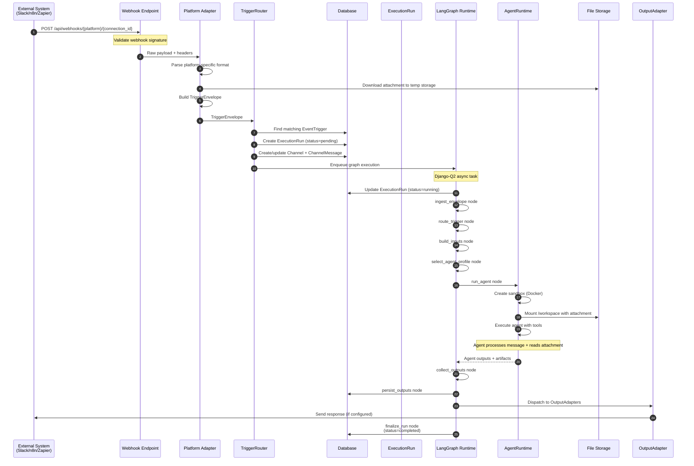
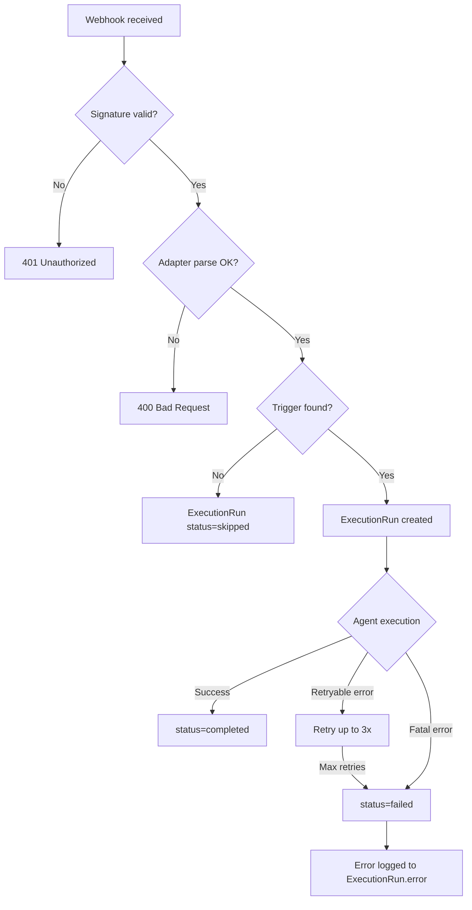

# Webhook Message Execution Flow

## Scenario
A webhook trigger receives a message with an attachment (e.g., a PDF document from Slack or n8n).

---

## Execution Breakdown



---

## Step-by-Step Breakdown

### Phase 1: Ingestion (Webhook → TriggerEnvelope)

| Step | Component | Action | Data |
|------|-----------|--------|------|
| 1 | **Webhook Endpoint** | Receive HTTP POST | Raw JSON payload |
| 2 | **Webhook Endpoint** | Validate signature | `X-Webhook-Signature` header |
| 3 | **Platform Adapter** | Parse platform format | Slack/Discord/n8n specific |
| 4 | **Platform Adapter** | Download attachment | Store to temp file or S3 |
| 5 | **Platform Adapter** | Build TriggerEnvelope | Normalized structure |

**TriggerEnvelope produced:**
```python
{
    "trigger_type": "webhook",
    "source": {
        "adapter": "slack",  # or "n8n", "zapier"
        "external_id": "evt_abc123",
        "metadata": {"workspace_id": "T12345"}
    },
    "channel": {
        "channel_id": None,  # Will be created/matched
        "external_id": "C98765",
        "type": "slack_channel",
        "display_name": "#general"
    },
    "payload": {
        "text": "Please analyze this document",
        "sender_id": "U12345",
        "sender_name": "alice",
        "timestamp": "2026-01-22T10:30:00Z"
    },
    "attachments": [
        {
            "type": "file",
            "filename": "report.pdf",
            "mime_type": "application/pdf",
            "size_bytes": 245000,
            "storage_path": "/tmp/uploads/abc123/report.pdf",
            # or "url": "https://storage.zoea.io/..."
        }
    ],
    "organization_id": 1,
    "project_id": 5,
    "workspace_id": None
}
```

---

### Phase 2: Routing (TriggerEnvelope → ExecutionRun)

| Step | Component | Action | Data |
|------|-----------|--------|------|
| 6 | **TriggerRouter** | Match EventTrigger | `event_type=webhook`, filters |
| 7 | **TriggerRouter** | Get/create Channel | By `adapter_type` + `external_id` |
| 8 | **TriggerRouter** | Create ChannelMessage | Store incoming message |
| 9 | **TriggerRouter** | Create ExecutionRun | `status=pending` |
| 10 | **TriggerRouter** | Enqueue task | Django-Q2 async |

**ExecutionRun created:**
```python
ExecutionRun(
    run_id="a1b2c3d4-...",
    organization_id=1,
    project_id=5,
    channel_id=42,  # Newly created or matched
    trigger_id=7,
    trigger_type="webhook",
    source_type="slack_message",
    source_id=None,
    workflow_slug=None,  # Determined by trigger
    graph_id="webhook_handler",
    status="pending",
    input_envelope={...},  # Full TriggerEnvelope
    inputs={},
)
```

**Channel created/matched:**
```python
Channel(
    organization_id=1,
    project_id=5,
    adapter_type="slack",
    external_id="C98765",
    display_name="#general",
)
```

**ChannelMessage created:**
```python
ChannelMessage(
    channel_id=42,
    external_id="msg_xyz789",
    sender_id="U12345",
    sender_name="alice",
    role="user",
    content="Please analyze this document",
    attachments=[{"filename": "report.pdf", ...}],
)
```

---

### Phase 3: LangGraph Execution

| Step | Node | Action | State Changes |
|------|------|--------|---------------|
| 11 | **ingest_envelope** | Normalize envelope | `state.envelope` populated |
| 12 | **route_trigger** | Select graph/pattern | `state.graph_id` set |
| 13 | **build_inputs** | Map envelope → inputs | `state.inputs` populated |
| 14 | **select_agent_profile** | Choose model/tools/runtime | `state.agent_profile` set |
| 15 | **run_agent** | Execute agent | `state.outputs` populated |
| 16 | **collect_outputs** | Gather artifacts | `state.artifacts` populated |
| 17 | **persist_outputs** | Save to DB | Documents created |
| 18 | **finalize_run** | Mark complete | `status=completed` |

**ExecutionState during run:**
```python
{
    "run_id": "a1b2c3d4",
    "execution_run_id": 123,
    "status": "running",
    "envelope": {...},  # TriggerEnvelope
    "inputs": {
        "message": "Please analyze this document",
        "attachments": ["/workspace/report.pdf"],
    },
    "graph_id": "webhook_handler",
    "agent_profile": {
        "provider": "openai",
        "model_id": "gpt-4o",
        "tools": ["document_reader", "summarizer"],
        "skills": [],
        "runtime": "docker",
        "max_steps": 10,
    },
    "outputs": [],
    "artifacts": [],
    "services": {"ai": <AIService>, "docs": <DocumentService>},
    "context": {
        "organization_id": 1,
        "project_id": 5,
        "user_id": None,
    },
    "steps": [],
    "telemetry": {},
}
```

---

### Phase 4: Agent Execution (with Attachment)

| Step | Component | Action | Details |
|------|-----------|--------|---------|
| 15a | **AgentRuntime** | Select executor | `DockerExecutor` (per agent_profile.runtime) |
| 15b | **DockerExecutor** | Create container | Image: `zoea-agent:latest` |
| 15c | **DockerExecutor** | Mount workspace | `/workspace` with attachment file |
| 15d | **DockerExecutor** | Copy attachment | `report.pdf` → `/workspace/report.pdf` |
| 15e | **Agent** | Read attachment | Tool: `document_reader` |
| 15f | **Agent** | Process content | Extract text, analyze |
| 15g | **Agent** | Generate response | Summarize, answer question |
| 15h | **DockerExecutor** | Collect outputs | Artifacts from `/workspace/outputs/` |
| 15i | **DockerExecutor** | Cleanup container | Remove temp container |

**Docker container setup:**
```bash
docker run --rm \
  --name zoea-run-a1b2c3d4 \
  --memory=512m \
  --cpus=1 \
  -v /tmp/uploads/abc123:/workspace/inputs:ro \
  -v /tmp/runs/a1b2c3d4/outputs:/workspace/outputs:rw \
  -e ZOEA_RUN_ID=a1b2c3d4 \
  -e ZOEA_ORG_ID=1 \
  zoea-agent:latest \
  python -m agent_runner
```

**Workspace structure:**
```
/workspace/
├── inputs/
│   └── report.pdf          # Mounted read-only
├── outputs/
│   ├── summary.md          # Agent-generated
│   └── analysis.json       # Agent-generated
└── context.json            # Execution context
```

---

### Phase 5: Output Processing

| Step | Component | Action | Result |
|------|-----------|--------|--------|
| 16 | **collect_outputs** | Read `/workspace/outputs/` | List of ExecutionOutput |
| 17a | **persist_outputs** | Create Documents | `summary.md` → Markdown doc |
| 17b | **persist_outputs** | Create Artifacts | Add to DocumentCollection |
| 17c | **persist_outputs** | Update ExecutionRun | `outputs` JSON field |
| 18a | **OutputAdapter** | Send Slack message | Reply in thread |
| 18b | **finalize_run** | Update status | `status=completed` |
| 18c | **finalize_run** | Record telemetry | Token usage, duration |

**ExecutionOutputs:**
```python
[
    {
        "kind": "document",
        "target": {"folder": "/Analyses"},
        "payload": {
            "name": "Report Analysis",
            "content": "## Summary\n\nThe document discusses...",
            "type": "MarkdownDocument",
        },
        "metadata": {"source_file": "report.pdf"},
    },
    {
        "kind": "message",
        "target": {
            "adapter": "slack",
            "channel_id": "C98765",
            "thread_ts": "1706012345.000100",
        },
        "payload": {
            "text": "Here's my analysis of the document:\n\n...",
        },
        "metadata": {},
    },
]
```

**Final ExecutionRun state:**
```python
ExecutionRun(
    run_id="a1b2c3d4-...",
    status="completed",
    outputs=[...],  # ExecutionOutputs
    telemetry={
        "tokens": {"input": 1250, "output": 430},
        "duration_ms": 8500,
        "steps": 4,
    },
    started_at="2026-01-22T10:30:01Z",
    completed_at="2026-01-22T10:30:10Z",
    artifacts_id=15,  # DocumentCollection
)
```

---

## Error Handling



---

## Key Files Involved

| Phase | File | Responsibility |
|-------|------|----------------|
| Ingestion | `platform_adapters/api.py` | Webhook endpoint |
| Ingestion | `platform_adapters/adapters/webhook.py` | Parse payload |
| Routing | `events/dispatcher.py` | Match trigger, create ExecutionRun |
| Routing | `channels/models.py` | Channel + ChannelMessage |
| Execution | `langgraph_runtime/runtime.py` | Run graph |
| Execution | `langgraph_runtime/nodes.py` | Graph nodes |
| Agent | `sandboxes/executors/docker.py` | Docker executor |
| Agent | `events/harness.py` | ScopedProjectAPI |
| Output | `output_dispatch/dispatcher.py` | Route outputs |
| Output | `workflows/services/documents.py` | Create documents |
