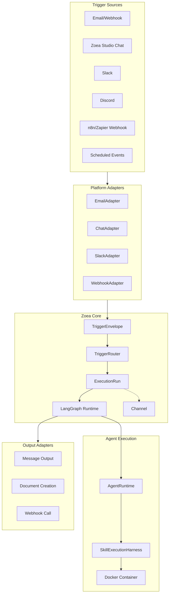

```mermaid
flowchart TB
      subgraph Sources["Trigger Sources"]
          EMAIL[Email/Webhook]
          CHAT[Zoea Studio Chat]
          SLACK[Slack]
          DISCORD[Discord]
          WEBHOOK[n8n/Zapier Webhook]
          SCHEDULE[Scheduled Events]
      end

      subgraph Adapters["Platform Adapters"]
          EA[EmailAdapter]
          CA[ChatAdapter]
          SA[SlackAdapter]
          WA[WebhookAdapter]
      end

      subgraph Core["Zoea Core"]
          TE[TriggerEnvelope]
          TR[TriggerRouter]
          ER[ExecutionRun]
          LG[LangGraph Runtime]
          CH[Channel]
      end

      subgraph Agent["Agent Execution"]
          AR[AgentRuntime]
          HARNESS[SkillExecutionHarness]
          DOCKER[Docker Container]
      end

      subgraph Outputs["Output Adapters"]
          MSG_OUT[Message Output]
          DOC_OUT[Document Creation]
          WEBHOOK_OUT[Webhook Call]
      end

      Sources --> Adapters --> TE --> TR --> ER --> LG
      ER -.-> CH
      LG --> AR --> HARNESS --> DOCKER
      LG --> Outputs
```