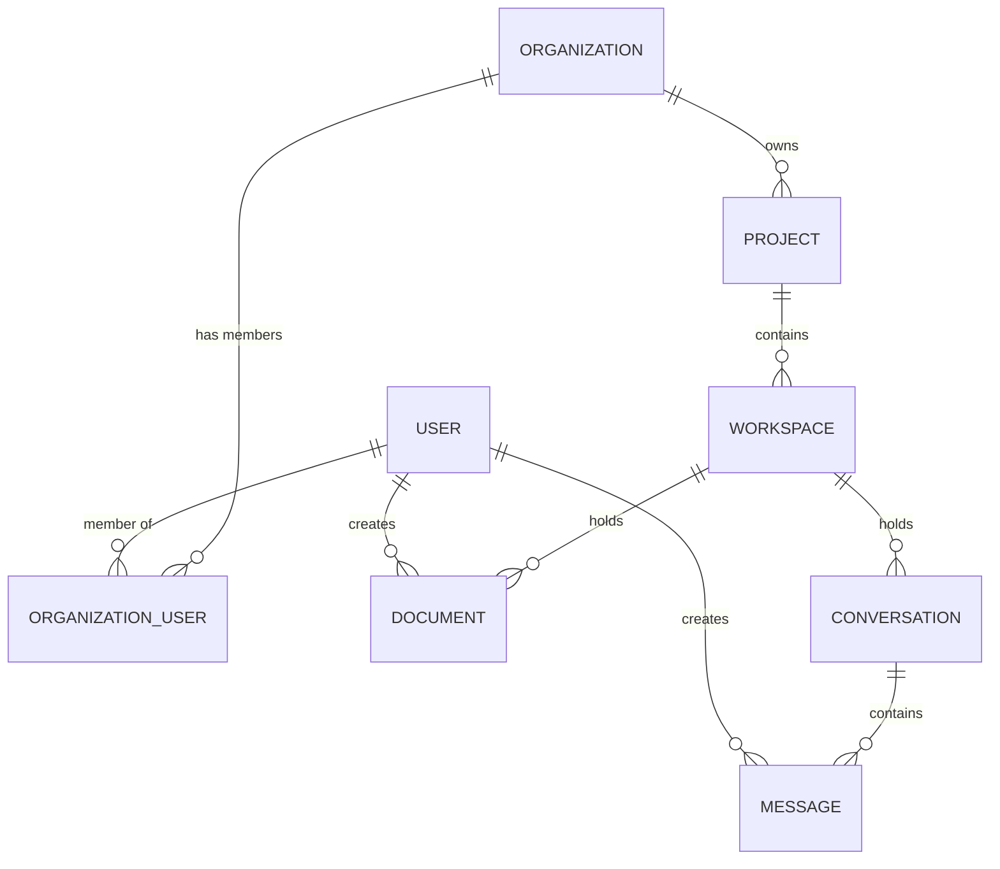

# Backend Architecture

The Zoea Collab backend is a Django 6.0 application with django-ninja for REST APIs, integrated with provider-based LLM backends (OpenAI/Gemini) for AI capabilities.

## Technology Stack

- **Django 6.0** - Web framework
- **django-ninja** - Type-safe REST API framework
- **django-organizations** - Multi-tenant architecture
- **PostgreSQL/SQLite** - Database (SQLite for development)
- **LLM provider abstraction** - AI orchestration (OpenAI/Gemini)
- **OpenAI API** - Chat completions
- **Google Gemini API** - File search and RAG
- **PocketFlow** - Workflow orchestration engine
- **Typer** - CLI framework with Rich formatting
- **Python 3.12** - Language runtime
- **uv** - Fast package installer

## Project Structure

```
backend/
├── zoeastudio/                 # Django project
│   ├── settings.py             # Configuration
│   ├── urls.py                 # URL routing
│   └── wsgi.py                 # WSGI entry point
├── accounts/                   # User & organization management
│   ├── models.py               # Account model
│   ├── managers.py             # OrganizationScopedQuerySet
│   ├── utils.py                # Helper functions
│   ├── admin.py                # Django admin
│   └── management/             # Management commands
│       └── commands/
│           └── initialize_local_user.py
├── chat/                       # Chat application
│   ├── models.py               # Conversation, Message models
│   ├── agent_service.py        # LLM provider integration
│   ├── graphologue_service.py  # Diagram generation
│   ├── api.py                  # REST API endpoints
│   ├── schemas.py              # Pydantic schemas
│   └── tests.py                # Test suite
├── cli/                        # Command-line interface
│   ├── cli.py                  # Main Typer app entry point
│   ├── commands/               # Command groups
│   │   ├── projects.py         # Project management
│   │   ├── workspaces.py       # Workspace management
│   │   ├── workflows.py        # Workflow discovery/execution
│   │   ├── documents.py        # Document operations
│   │   ├── clipboard.py        # Clipboard management
│   │   └── chats.py            # Conversation management
│   └── utils/                  # CLI utilities
│       ├── config.py           # Configuration and org filtering
│       ├── django_context.py   # @with_django decorator
│       └── formatting.py       # Rich console formatting
├── documents/                  # Document management
│   ├── models.py               # Project, Workspace, Document models
│   ├── gemini_service.py       # Gemini File Search service
│   ├── api.py                  # Document API endpoints
│   ├── signals.py              # Auto-create Project/Workspace
│   └── management/             # Management commands
│       └── commands/
│           ├── sync_gemini_file_search.py
│           ├── list_gemini_stores.py
│           └── query_gemini_store.py
├── workflows/                  # Workflow orchestration
│   ├── models.py               # Workflow model (org-scoped)
│   ├── runner.py               # WorkflowRunner async engine
│   ├── config.py               # YAML config loader
│   ├── types.py                # Pydantic specs (InputSpec, etc.)
│   ├── context.py              # WorkflowContext dataclass
│   ├── registry.py             # Service and Workflow registries
│   ├── exceptions.py           # WorkflowError
│   ├── services/               # Workflow services
│   │   ├── ai.py               # AIService (OpenAI wrapper)
│   │   ├── github.py           # PyGithubInterface
│   │   └── documents.py        # DocumentService
│   └── builtin/                # Built-in workflows
│       └── plan_github_issue/  # Example workflow
│           ├── flow-config.yaml
│           ├── flow.py
│           └── nodes.py
├── transformations/            # Content transformation system
│   ├── models.py               # TransformationJob model
│   ├── registry.py             # Transformer registry
│   ├── transformers/           # Transformer implementations
│   ├── api.py                  # Transformation API
│   └── README.md               # Comprehensive guide
├── manage.py                   # Django management script
└── pyproject.toml              # Python dependencies
```

## Layer Architecture

### 1. Models Layer

Django models define data structure and business logic:

```python
# documents/models.py
from django.db import models
from accounts.managers import OrganizationScopedQuerySet

class ProjectQuerySet(OrganizationScopedQuerySet):
    def for_user(self, user):
        return self.filter(
            organization__organization_users__user=user
        )

class Project(models.Model):
    organization = models.ForeignKey(
        'organizations.Organization',
        on_delete=models.CASCADE
    )
    name = models.CharField(max_length=200)
    created_by = models.ForeignKey(User, on_delete=models.CASCADE)
    created_at = models.DateTimeField(auto_now_add=True)

    objects = ProjectQuerySet.as_manager()

    class Meta:
        ordering = ['-created_at']
        indexes = [
            models.Index(fields=['organization', 'created_at']),
        ]
```

### 2. Service Layer

Services handle external integrations and complex operations:

```python
# chat/agent_service.py
from llm_providers import ChatMessage, LLMProviderRegistry, resolve_llm_config

class ChatAgentService:
    """Service for managing chat interactions via configured LLM provider."""

    def __init__(self, project=None):
        self.config = resolve_llm_config(project=project)
        self.provider = LLMProviderRegistry.get(self.config.provider, config=self.config)

    def create_agent(self, name: str, instructions: str):
        """Create a new agent with custom instructions."""
        self.name = name
        self.instructions = instructions

    async def chat(self, message: str) -> str:
        """Send a message and get complete response."""
        messages = [
            ChatMessage(role="system", content=self.instructions),
            ChatMessage(role="user", content=message),
        ]
        response = await self.provider.chat_async(messages, model_id=self.config.model_id)
        return response.content

    async def chat_stream(self, message: str):
        """Stream response chunks."""
        messages = [
            ChatMessage(role="system", content=self.instructions),
            ChatMessage(role="user", content=message),
        ]
        async for chunk in self.provider.chat_stream_async(messages, model_id=self.config.model_id):
            if chunk.content:
                yield chunk.content
```

### 3. API Layer

Django Ninja provides type-safe REST APIs:

```python
# chat/api.py
from ninja import Router
from .schemas import ChatRequest, ChatResponse
from .agent_service import ChatAgentService
from accounts.utils import require_organization

router = Router()

@router.post("/chat", response=ChatResponse)
async def chat(request, data: ChatRequest):
    """Send a message to the AI agent."""
    # Verify user has organization
    org = require_organization(request.user)

    # Create agent with organization context
    service = ChatAgentService()
    instructions = f"You are assisting {request.user.username} from {org.name}."
    service.create_agent(name=data.agent_name, instructions=instructions)

    # Get response
    response = await service.chat(data.message)

    return ChatResponse(
        response=response,
        agent_name=data.agent_name
    )
```

### 4. Schema Layer

Pydantic schemas for request/response validation:

```python
# chat/schemas.py
from pydantic import BaseModel, Field

class ChatRequest(BaseModel):
    message: str = Field(..., min_length=1, max_length=5000)
    agent_name: str = Field(default="ZoeaAssistant")
    instructions: str = Field(default="You are a helpful assistant.")
    conversation_history: str | None = None

class ChatResponse(BaseModel):
    response: str
    agent_name: str
    diagram: DiagramData | None = None
```

## Core Django Apps

### accounts

**Purpose:** User and organization management using django-organizations.

**Key Models:**
- `Account` (extends `Organization`) - Multi-tenant container

**Key Files:**
- `managers.py` - `OrganizationScopedQuerySet` for automatic filtering
- `utils.py` - Helper functions (`get_user_organization`, `require_organization`)
- `management/commands/initialize_local_user.py` - Setup command

**See:** [Multi-Tenant Guide](multi-tenant.md) for detailed patterns.

### chat

**Purpose:** AI-powered chat with conversation management and diagram generation.

**Key Models:**
- `Conversation` - Chat session
- `Message` - Individual message in conversation

**Services:**
- `ChatAgentService` - LLM provider integration
- `GraphologueService` - Converts conversations to concept maps

**API Endpoints:**
- `POST /api/chat` - Send message, receive response + optional diagram
- `GET /api/health` - Health check

### documents

**Purpose:** Project, workspace, and document management with Gemini File Search integration.

**Key Models:**
- `Project` - Main organizational unit
- `Workspace` - Scoped view of project
- `Document` (abstract) - Base for all document types
  - `Image`, `PDF`, `TextDocument` (Markdown, Diagram, CSV)

**Services:**
- `GeminiFileSearchService` - Semantic search and RAG

**Signals:**
- Auto-create default Project when Organization is created
- Auto-create default Workspace when Project is created

**Management Commands:**
- `sync_gemini_file_search` - Sync documents to Gemini
- `list_gemini_stores` - List all File Search stores
- `query_gemini_store` - Query documents with natural language

### transformations

**Purpose:** Flexible content transformation system (Markdown ↔ HTML ↔ PDF ↔ Graphologue).

**Key Components:**
- `TransformerRegistry` - Plugin-based transformer discovery
- `BaseTransformer` - Abstract base for transformers
- Built-in transformers: Markdown→HTML, HTML→Markdown, Markdown→PDF, Text→Graphologue

**API Endpoints:**
- `POST /api/transformations/transform` - Transform content
- `GET /api/transformations/list` - List available transformations

**See:** `backend/transformations/README.md` for comprehensive guide.

### cli

**Purpose:** Typer-based command-line interface for project and workflow management.

**Key Components:**
- `cli.py` - Main Typer app with command group registration
- `commands/` - Command implementations (projects, workspaces, workflows, etc.)
- `utils/` - Django context injection, Rich formatting, config loading

**Command Groups:**
- `zoea projects` - List and show project details
- `zoea workspaces` - List, show, and display workspace trees
- `zoea workflows` - Discover, show, and run workflows
- `zoea documents` - Document operations
- `zoea clipboard` - Clipboard management
- `zoea chats` - Conversation management

**Key Features:**
- Django context via `@with_django` decorator
- Rich terminal formatting with colored tables and panels
- Organization-scoped filtering via `--org` flag or config file
- Configuration via `~/.zoea/config.yaml`

**See:** [CLI Documentation](../features/cli.md) for complete usage guide.

### workflows

**Purpose:** PocketFlow-based workflow orchestration with YAML configuration.

**Key Components:**
- `runner.py` - `WorkflowRunner` async execution engine
- `config.py` - YAML configuration loader and validator
- `types.py` - Pydantic specs (`InputSpec`, `OutputSpec`, `ServiceSpec`, `WorkflowSpec`)
- `context.py` - `WorkflowContext` dataclass for flow execution
- `registry.py` - Service and Workflow registries
- `services/` - Built-in services (AI, GitHub, Documents)
- `builtin/` - Built-in workflow implementations

**Workflow Lifecycle:**
1. Load YAML configuration → `WorkflowSpec`
2. Validate inputs against `InputSpec`
3. Build `WorkflowContext` with inputs and Django objects
4. Instantiate and bind services from `ServiceSpec`
5. Execute PocketFlow with shared context dict
6. Process outputs → create documents via `OutputSpec`

**Built-in Services:**
- `AIService` - OpenAI ChatCompletion wrapper
- `PyGithubInterface` - GitHub API client
- `DocumentService` - Creates documents from workflow outputs

**See:** [Workflows Documentation](../features/workflows.md) for complete guide.

## Database Design

### Entity Relationships



### Key Constraints

1. **Organization Scoping:** Every tenant resource has `organization` FK
2. **Uniqueness:** Enforce unique constraints where appropriate
   ```python
   class Meta:
       unique_together = ('organization', 'slug')
   ```
3. **Indexes:** Add indexes for common queries
   ```python
   class Meta:
       indexes = [
           models.Index(fields=['organization', '-created_at']),
       ]
   ```

## Service Pattern

Services encapsulate external integrations and complex business logic:

### Agent Service

```python
# chat/agent_service.py
class ChatAgentService:
    """Manages chat interactions via configured LLM provider."""

    async def chat(self, message: str) -> str:
        """Send message and receive complete response."""
        response = await self.provider.chat_async(...)
        return response.content

    async def chat_stream(self, message: str):
        """Stream response chunks in real-time."""
        async for chunk in self.provider.chat_stream_async(...):
            yield chunk.content
```

### Gemini Service

```python
# documents/gemini_service.py
class GeminiFileSearchService:
    """Manages Gemini File Search stores and document uploads."""

    def create_file_search_store(self, project):
        """Create a File Search store for a project."""
        # ...

    def upload_document(self, document, store_id):
        """Upload document to File Search store."""
        # ...

    def query_store(self, store_id, query):
        """Query store with natural language."""
        # ...
```

## API Design with Django Ninja

### Router Organization

```python
# zoeastudio/urls.py
from ninja import NinjaAPI
from chat.api import router as chat_router
from documents.api import router as documents_router

api = NinjaAPI()
api.add_router("/chat", chat_router)
api.add_router("/documents", documents_router)

urlpatterns = [
    path("api/", api.urls),
    path("admin/", admin.site.urls),
]
```

### Type Safety

Pydantic schemas provide automatic validation:

```python
@router.post("/documents", response=DocumentResponse)
def create_document(request, data: DocumentCreate):
    # data is validated automatically
    # TypeErrors caught before reaching view logic
    doc = Document.objects.create(
        organization=require_organization(request.user),
        title=data.title,  # Validated by Pydantic
        content=data.content
    )
    return DocumentResponse.from_orm(doc)
```

### Error Handling

```python
from ninja import Router
from ninja.errors import HttpError

@router.get("/documents/{doc_id}")
def get_document(request, doc_id: int):
    try:
        doc = Document.objects.for_user(request.user).get(id=doc_id)
    except Document.DoesNotExist:
        raise HttpError(404, "Document not found")

    return DocumentResponse.from_orm(doc)
```

## Async Support

Django 6.0 + django-ninja support async views:

```python
@router.post("/chat")
async def chat(request, data: ChatRequest):
    service = ChatAgentService()
    service.create_agent(name=data.agent_name, instructions=data.instructions)

    # Async operations
    response = await service.chat(data.message)

    return ChatResponse(response=response, agent_name=data.agent_name)
```

## Testing

### Test Structure

```python
# chat/tests.py
import pytest
from django.contrib.auth.models import User
from accounts.models import Account
from .agent_service import ChatAgentService

@pytest.fixture
def organization():
    return Account.objects.create(name="Test Org")

@pytest.fixture
def user(organization):
    user = User.objects.create_user(username="test", password="pass")
    organization.add_user(user)
    return user

@pytest.mark.django_db
@pytest.mark.asyncio
async def test_agent_chat():
    service = ChatAgentService()
    service.create_agent(name="test", instructions="You are helpful.")

    response = await service.chat("Hello")

    assert isinstance(response, str)
    assert len(response) > 0
```

### Running Tests

```bash
cd backend

# All tests
uv run pytest

# With coverage
uv run pytest --cov=. --cov-report=html

# Specific test file
uv run pytest chat/tests.py

# Specific test
uv run pytest chat/tests.py::test_agent_chat
```

## Management Commands

Custom Django commands in `*/management/commands/`:

### initialize_local_user

Create a complete local development environment:

```bash
cd backend
uv run python manage.py initialize_local_user \
    --username admin \
    --password admin \
    --org-name "My Organization"
```

### sync_gemini_file_search

Sync project documents to Gemini File Search:

```bash
uv run python manage.py sync_gemini_file_search --project "My Project"
```

### query_gemini_store

Query documents with natural language:

```bash
uv run python manage.py query_gemini_store \
    "What is this project about?" \
    --project "My Project"
```

## Configuration

### Settings Structure

```python
# zoeastudio/settings.py

# Multi-tenant
INSTALLED_APPS = [
    'organizations',
    'accounts',
    # ...
]

# Database
DATABASES = {
    'default': {
        'ENGINE': 'django.db.backends.sqlite3',  # Dev
        # 'ENGINE': 'django.db.backends.postgresql',  # Prod
    }
}

# API Keys (from environment)
OPENAI_API_KEY = os.getenv('OPENAI_API_KEY')
GEMINI_API_KEY = os.getenv('GEMINI_API_KEY')

# CORS (automatically configured from ZOEA_FRONTEND_PORT)
CORS_ALLOWED_ORIGINS = [
    f"http://localhost:{os.getenv('ZOEA_FRONTEND_PORT', 5173)}"
]
```

### Environment Variables

See `.env.example` for all available configuration options.

## Next Steps

- [Multi-Tenant Guide](multi-tenant.md) - Critical organization-scoping patterns
- [Frontend Architecture](frontend.md) - React components and state management
- [CLI Documentation](../features/cli.md) - Command-line interface guide
- [Workflows Documentation](../features/workflows.md) - Workflow orchestration guide
- [API Reference](../development/api-reference.md) - Available endpoints
- [Testing Guide](../development/testing.md) - Write effective backend tests
