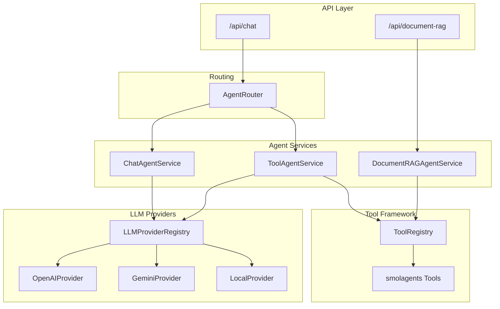

# LLM Providers & Agent Services

This document provides a technical overview of the agent services, LLM provider integrations, and tool framework in Zoea Studio.

## Architecture Overview



## Agent Services

### ChatAgentService

**Location:** `backend/chat/agent_service.py`

General-purpose chat service using the LLM provider abstraction. Supports streaming, conversation history, and multimodal inputs.

```python
from chat.agent_service import ChatAgentService

service = ChatAgentService(project=project)
service.create_agent(name="assistant", instructions="You are helpful.")

# Async chat
response = await service.chat(message="Hello", conversation_messages=[...])

# Streaming
async for chunk in service.chat_stream(message="Tell me a story"):
    print(chunk, end="")
```

**Key Features:**

- Project-scoped LLM configuration
- Conversation history support
- Multimodal input (images for vision models)
- Async and streaming interfaces

### ToolAgentService

**Location:** `backend/chat/tool_agent_service.py`

Tool-calling agent built on [smolagents](https://github.com/huggingface/smolagents) `CodeAgent`. Executes tools, collects artifacts, and provides execution telemetry.

```python
from chat.tool_agent_service import ToolAgentService

service = ToolAgentService(
    project=project,
    tools=enabled_tools,
    context={"workspace_id": workspace.id},
    max_steps=10
)

result = await service.chat(message="Search for Python tutorials")
print(result.response)
print(result.tools_called)  # ["web_search"]
print(result.artifacts)     # Generated images, documents, etc.
```

**Response Type:** `ToolAgentResponse`

| Field | Type | Description |
|-------|------|-------------|
| `response` | `str` | Agent's text response |
| `tools_called` | `list[str]` | Names of tools invoked |
| `steps` | `list[dict]` | Step-by-step execution trace |
| `telemetry` | `dict` | Token usage, timing, errors |
| `artifacts` | `list[ToolArtifactData]` | Created images, code, documents |

### DocumentRAGAgentService

**Location:** `backend/document_rag/agent_service.py`

RAG-based document chat agent with retrieval tools, image analysis, and session management.

```python
from document_rag.agent_service import DocumentRAGAgentService

service = DocumentRAGAgentService(session=rag_session, project=project)

result = await service.chat(
    message="What does the architecture document say about authentication?",
    conversation_history=[...]
)

print(result.response)
print(result.sources)         # Retrieved document sources
print(result.thinking_steps)  # Reasoning steps
```

**Built-in Tools:**

- `DocumentRetrieverTool` - Semantic search via FileSearchRegistry
- `ImageAnalyzerTool` - OpenAI vision for document images
- `SkillLoaderTool` - Dynamic skill/workflow integration

**Session Types:** Single document, folder, clipboard, collection contexts

### AgentRouter

**Location:** `backend/agents/router.py`

Routes chat requests to the appropriate agent type based on context.

```python
from agents.router import AgentRouter
from agents.context import AgentContext

router = AgentRouter()
result = router.route(context)

# result.agent_type: CHAT | DOCUMENT_RAG | EXCALIDRAW | DEEP_RESEARCH
# result.tools: list of enabled tools
# result.config: context-specific configuration
```

**Routing Logic:**

| Condition | Agent Type |
|-----------|------------|
| Excalidraw document | `EXCALIDRAW` |
| RAG session or multi-document | `DOCUMENT_RAG` |
| Deep research capability | `DEEP_RESEARCH` |
| Default | `CHAT` |

## LLM Provider Architecture

### Provider Interface

**Location:** `backend/llm_providers/base.py`

Abstract base class defining the LLM provider contract.

```python
from llm_providers.base import LLMProvider, ChatMessage, ChatResponse

class LLMProvider(ABC):
    @abstractmethod
    def list_models(self) -> list[ModelInfo]: ...

    @abstractmethod
    async def chat_async(
        self,
        messages: list[ChatMessage],
        model_id: str,
        **kwargs
    ) -> ChatResponse: ...

    @abstractmethod
    async def chat_stream_async(
        self,
        messages: list[ChatMessage],
        model_id: str,
        **kwargs
    ) -> AsyncGenerator[StreamChunk, None]: ...
```

**Type Definitions:**

| Type | Description |
|------|-------------|
| `ChatMessage` | Message with role, content, tool calls |
| `ChatResponse` | Completion with content, usage, tool calls |
| `StreamChunk` | Streaming chunk with partial content |
| `ModelInfo` | Model metadata (context window, capabilities) |

### Provider Registry

**Location:** `backend/llm_providers/registry.py`

Singleton registry for provider instances.

```python
from llm_providers import LLMProviderRegistry

# Get provider instance
provider = LLMProviderRegistry.get("openai", config=llm_config)

# List available providers
providers = LLMProviderRegistry.list_providers()  # ["openai", "gemini", "local"]

# Set default
LLMProviderRegistry.set_default("gemini")
```

### Registered Providers

#### OpenAI Provider

**Location:** `backend/llm_providers/providers/openai.py`

| Model | Context | Vision | Tools | Streaming |
|-------|---------|--------|-------|-----------|
| `gpt-4o` | 128K | Yes | Yes | Yes |
| `gpt-4o-mini` | 128K | Yes | Yes | Yes |
| `gpt-4-turbo` | 128K | Yes | Yes | Yes |
| `gpt-3.5-turbo` | 16K | No | Yes | Yes |

#### Gemini Provider

**Location:** `backend/llm_providers/providers/gemini.py`

| Model | Context | Vision | Tools | Streaming |
|-------|---------|--------|-------|-----------|
| `gemini-2.5-flash` | 1M | Yes | Yes | Yes |
| `gemini-2.5-pro` | 1M | Yes | Yes | Yes |
| `gemini-2.0-flash` | 1M | Yes | Yes | Yes |
| `gemini-1.5-pro` | 1M | Yes | Yes | Yes |

**Additional:** Native file search integration for RAG

#### Local Provider

**Location:** `backend/llm_providers/providers/local.py`

OpenAI-compatible endpoint for local models (Ollama, vLLM, etc.).

```python
# Default endpoint
http://localhost:11434/v1

# Or configure per-project
project.local_model_endpoint = "http://my-server:8000/v1"
```

### Configuration Resolution

**Location:** `backend/llm_providers/config.py`

LLM configuration is resolved in priority order:

1. **Agent/Conversation Override** - Per-request customization
2. **Project Settings** - `project.llm_provider`, `project.llm_model_id`
3. **App Defaults** - Django settings `DEFAULT_LLM_PROVIDER`, `DEFAULT_LLM_MODEL`

```python
from llm_providers.config import resolve_llm_config

config = resolve_llm_config(project=project, agent_config=override)
# config.provider: "openai"
# config.model_id: "gpt-4o"
# config.api_key: "sk-..."
```

**LLMConfig Fields:**

| Field | Type | Description |
|-------|------|-------------|
| `provider` | `str` | Provider name |
| `model_id` | `str` | Model identifier |
| `api_key` | `str \| None` | API key (if required) |
| `endpoint` | `str \| None` | Custom endpoint (local models) |
| `temperature` | `float` | Sampling temperature (default: 0.7) |
| `max_tokens` | `int \| None` | Max output tokens |

## Tool Framework

### Tool Registry

**Location:** `backend/agents/registry.py`

Singleton registry for smolagents tools with context filtering.

```python
from agents.registry import ToolRegistry

registry = ToolRegistry.get_instance()

# Get tools enabled for project/context
tools = registry.get_enabled_tools(project=project, context="chat")
```

### Built-in Tools

| Tool | Category | Description |
|------|----------|-------------|
| `WebSearchTool` | Search | DuckDuckGo web search |
| `VisitWebpageTool` | Search | Fetch and read URLs |
| `ProjectDocumentSearchTool` | Search | Project document search |
| `ImageAnalyzerTool` | Analysis | OpenAI vision analysis |
| `DocumentRetrieverTool` | Analysis | File search retrieval |
| `UnstructuredTool` | Analysis | Document extraction |
| `OpenAIImageGenTool` | Generation | DALL-E image generation |
| `HuggingFaceImageGenTool` | Generation | Stable Diffusion / FLUX |
| `GeminiImageGenTool` | Generation | Gemini image generation |
| `WebpageSummarizerTool` | Misc | Summarize webpage content |
| `SkillLoaderTool` | Misc | Dynamic skill invocation |

### Custom Tools

**Base Class:** `backend/agents/tools/base.py`

```python
from agents.tools.base import ZoeaTool

class MyCustomTool(ZoeaTool):
    name = "my_tool"
    description = "Does something useful"
    inputs = {
        "query": {"type": "string", "description": "Search query"}
    }
    output_type = "string"

    def forward(self, query: str) -> str:
        # Tool implementation
        result = do_something(query)

        # Optionally create artifacts
        self.create_artifact(
            artifact_type="image",
            path="/path/to/image.png",
            mime_type="image/png",
            title="Generated Image"
        )

        return result
```

**Register Custom Tool:**

```python
from agents.registry import ToolRegistry

registry = ToolRegistry.get_instance()
registry.register(
    name="my_tool",
    description="Does something useful",
    tool_class=MyCustomTool,
    category="custom",
    default_enabled=True,
    supported_contexts=["chat", "rag"]
)
```

## Non-Agent LLM Interfaces

Some components use LLM providers directly without the agent abstraction:

| Component | Location | Provider | Purpose |
|-----------|----------|----------|---------|
| Image Caption Service | `backend/documents/image_caption_service.py` | OpenAI | Generate image captions |
| Gemini File Search | `backend/documents/gemini_service.py` | Gemini | Document indexing and search |
| Tool-level LLM | Various tools | Per-tool | WebpageSummarizer, ImageAnalyzer |

## Workflow Integration

### Current State

Workflows integrate with agents through the `AIService` wrapper:

**Location:** `backend/workflows/services/ai.py`

```python
from workflows.services.ai import AIService

class AIService:
    def __init__(self, model_id: str = None):
        # Wraps ChatAgentService
        self.agent = ChatAgentService(...)

    def chat(self, message, conversation_messages=None, agent_name=None, instructions=None):
        # Sync interface for workflow nodes
        return asyncio.run(self.agent.chat(...))

    async def achat(self, ...):
        # Async interface
        return await self.agent.chat(...)
```

**Built-in Workflows Using AIService:**

- `backend/workflows/builtin/summarize_content/nodes.py`
- `backend/workflows/builtin/plan_github_issue/nodes.py`

### Integration Gaps

| Agent Service | Workflow Integration | Notes |
|---------------|---------------------|-------|
| `ChatAgentService` | **Yes** | Via `AIService` wrapper |
| `ToolAgentService` | **No** | Workflows cannot use tool-calling |
| `DocumentRAGAgentService` | **No** | No RAG sessions in workflows |
| `AgentRouter` | **No** | No dynamic routing |

**Current Limitations:**

1. **No tool routing** - Workflow nodes cannot access the smolagents tool ecosystem
2. **No RAG sessions** - Workflows cannot leverage document retrieval
3. **Limited telemetry** - `backend/workflows/tasks.py` records provider/model from defaults only

## File Search Abstraction

**Location:** `backend/file_search/`

Backend-agnostic semantic search interface.

```python
from file_search import FileSearchRegistry

# Get backend
store = FileSearchRegistry.get("gemini")  # or "chromadb"

# Create store
store_info = store.create_store("my-store")

# Add document
store.add_document(store_info.id, document)

# Search
results = store.search(
    store_id=store_info.id,
    query="authentication patterns",
    max_results=5,
    filters={"organization_id": org.id}
)
```

**Registered Backends:**

| Backend | Location | Features |
|---------|----------|----------|
| Gemini | `backend/file_search/backends/gemini.py` | Native file search, grounding |
| ChromaDB | `backend/file_search/backends/chromadb.py` | Vector DB, metadata filtering |

## Key Files Reference

| Component | File Path |
|-----------|-----------|
| Chat Agent | `backend/chat/agent_service.py` |
| Tool Agent | `backend/chat/tool_agent_service.py` |
| RAG Agent | `backend/document_rag/agent_service.py` |
| Agent Router | `backend/agents/router.py` |
| Agent Context | `backend/agents/context.py` |
| LLM Base | `backend/llm_providers/base.py` |
| LLM Registry | `backend/llm_providers/registry.py` |
| LLM Config | `backend/llm_providers/config.py` |
| OpenAI Provider | `backend/llm_providers/providers/openai.py` |
| Gemini Provider | `backend/llm_providers/providers/gemini.py` |
| Local Provider | `backend/llm_providers/providers/local.py` |
| Tool Registry | `backend/agents/registry.py` |
| Tool Base | `backend/agents/tools/base.py` |
| Workflow AI Service | `backend/workflows/services/ai.py` |
| File Search Registry | `backend/file_search/registry.py` |

## Related Documentation

- [Backend Architecture](backend.md) - Service layer patterns
- [Document RAG System](document-rag.md) - RAG architecture details
- [Workflows](../features/workflows.md) - Workflow orchestration guide
- [Configuration](../reference/configuration.md) - Environment variables
