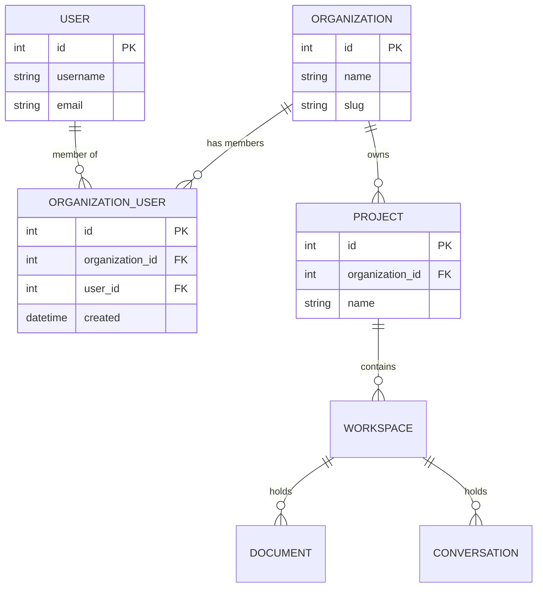

# Multi-Tenant Architecture

Zoea Collab implements multi-tenant architecture using **django-organizations**. This guide establishes critical patterns that **all developers must follow** when building new features.

!!! danger "Critical Pattern"
    Every tenant-scoped resource MUST include an `organization` ForeignKey. Access control MUST use custom querysets, not view-level checks.

## Overview

Every Django user in Zoea Collab belongs to an Organization via an Account. This provides:

- **Multi-tenant architecture** out of the box
- **Clear user-organization** relationships
- **Built-in invitation** and membership management
- **Flexible permission** and access control

## Core Concepts

### Model Structure

```python
Organization (Company/Team)
  └── OrganizationUser (Membership)
      └── User (Django User)

OrganizationOwner (Special type of OrganizationUser)
```



**Key Principle:** Users are linked to Organizations through the explicit `OrganizationUser` model, NOT via direct many-to-many relationships.

## Model Inheritance Strategies

Choose the right inheritance approach based on your needs:

### Proxy Models (Minimal Customization)

```python
class Account(Organization):
    class Meta:
        proxy = True
```

**Use when:** Only customizing admin interface, no additional fields needed.

### Multi-Table Inheritance (Adding Fields)

```python
class Account(Organization):
    subscription_plan = models.CharField(max_length=50)
    billing_email = models.EmailField()

    class Meta:
        verbose_name = "Account"
        verbose_name_plural = "Accounts"
```

**Use when:** Adding fields to organizations while keeping base model features.

!!! warning "Limitation"
    Only **one** custom organization model per app.

### Abstract Models (Complete Customization)

```python
from organizations.base import OrganizationBase

class Account(OrganizationBase):
    # Complete control - implement all features yourself
    pass
```

**Use when:** Need complete control over implementation.

## Critical Patterns

### 1. User-Organization Relationships

**❌ DON'T: Expose many-to-many relationships directly**

```python
# Avoid this pattern
organization.users.all()  # Bypasses invitation workflow
```

**✅ DO: Manage users through OrganizationUser**

```python
# Correct pattern
organization.organization_users.all()

# Or via the through relationship
organization.users.through.objects.filter(organization=org)
```

**Why?** This accounts for invitation workflows and provides better admin experience.

### 2. Resource Association

**Linking Resources to Organizations:**

```python
class Document(models.Model):
    organization = models.ForeignKey(
        'organizations.Organization',
        on_delete=models.CASCADE,
        related_name='documents'
    )
    project = models.ForeignKey(Project, on_delete=models.CASCADE)
    created_by = models.ForeignKey(User, on_delete=models.CASCADE)
    title = models.CharField(max_length=200)
    content = models.TextField()
```

**For Third-Party Models:**

Create explicit linking models with uniqueness constraints:

```python
class OrganizationResource(models.Model):
    organization = models.ForeignKey(Organization, on_delete=models.CASCADE)
    resource = models.ForeignKey(ThirdPartyModel, on_delete=models.CASCADE)

    class Meta:
        unique_together = ('organization', 'resource')
```

### 3. Access Control & Security

**❌ DON'T: Rely solely on view-level checks**

```python
# Fragile approach - prone to bugs
def my_view(request):
    if not request.user.organization_set.exists():
        return HttpResponseForbidden()

    # Data could leak if filtering is forgotten
    documents = Document.objects.all()
```

**✅ DO: Use custom querysets and managers**

```python
from accounts.managers import OrganizationScopedQuerySet

class DocumentQuerySet(OrganizationScopedQuerySet):
    def for_organization(self, organization):
        return self.filter(organization=organization)

    def for_user(self, user):
        return self.filter(
            organization__organization_users__user=user
        )

class Document(models.Model):
    objects = DocumentQuerySet.as_manager()
    organization = models.ForeignKey(Organization, on_delete=models.CASCADE)
    # ... other fields

# In views - filtering is built-in
documents = Document.objects.for_user(request.user)
```

**Key Principle:** "Relying on the filters from related managers whenever possible reduces the room for mistakes."

See `backend/accounts/managers.py` for the reusable `OrganizationScopedQuerySet`.

### 4. API Integration

**Pattern for Django Ninja endpoints:**

```python
from ninja import Router
from accounts.utils import get_user_organization, require_organization

router = Router()

@router.post("/documents")
def create_document(request, data: DocumentCreate):
    # Get and verify user's organization
    org = require_organization(request.user)

    # Create resource scoped to organization
    document = Document.objects.create(
        organization=org,
        created_by=request.user,
        title=data.title,
        content=data.content
    )

    return {"id": document.id, "title": document.title}

@router.get("/documents")
def list_documents(request):
    # Automatic filtering by organization
    documents = Document.objects.for_user(request.user)
    return [{"id": d.id, "title": d.title} for d in documents]
```

## Common Patterns in Zoea Collab

### Pattern: Organization-Scoped Conversations

```python
# backend/chat/models.py
class Conversation(models.Model):
    organization = models.ForeignKey('organizations.Organization', on_delete=models.CASCADE)
    workspace = models.ForeignKey('documents.Workspace', on_delete=models.CASCADE)
    created_by = models.ForeignKey(User, on_delete=models.CASCADE)

    objects = ConversationQuerySet.as_manager()

# backend/chat/api.py
@router.post("/conversations")
def create_conversation(request, data: ConversationCreate):
    org = require_organization(request.user)

    conversation = Conversation.objects.create(
        organization=org,
        workspace=data.workspace,
        created_by=request.user
    )

    return {"id": conversation.id}
```

### Pattern: Organization Context in AI Agents

```python
# Pass organization context to AI agents
from chat.agent_service import ChatAgentService
from accounts.utils import get_user_organization

service = ChatAgentService()
org = get_user_organization(request.user)

instructions = f"""
You are assisting {request.user.get_full_name()}
from {org.name}.

Organization context:
- Projects: {org.projects.count()}
- Members: {org.organization_users.count()}
"""

agent = service.create_agent(
    name="org_assistant",
    instructions=instructions
)
```

### Pattern: Multi-Tenant Document Storage

```python
class Document(models.Model):
    organization = models.ForeignKey(Organization, on_delete=models.CASCADE)
    project = models.ForeignKey(Project, on_delete=models.CASCADE)
    file = models.FileField(upload_to='documents/%Y/%m/%d/')

    objects = DocumentQuerySet.as_manager()

    def save(self, *args, **kwargs):
        # Verify project belongs to organization
        if self.project.organization_id != self.organization_id:
            raise ValueError("Project must belong to the same organization")
        super().save(*args, **kwargs)
```

## Helper Utilities

Zoea Collab provides utility functions in `backend/accounts/utils.py`:

### `get_user_organization(user)`

Get the first organization a user belongs to:

```python
from accounts.utils import get_user_organization

org = get_user_organization(request.user)
if org:
    # User has an organization
    pass
```

### `require_organization(user)`

Get organization or raise 403 error:

```python
from accounts.utils import require_organization

org = require_organization(request.user)  # Raises Forbidden if no org
```

### `get_user_organizations(user)`

Get all organizations for a user:

```python
from accounts.utils import get_user_organizations

orgs = get_user_organizations(request.user)
```

## Invitation Workflow

### Custom Invitation Forms

```python
from organizations.forms import OrganizationUserForm

class CustomInvitationForm(OrganizationUserForm):
    def save(self, commit=True):
        instance = super().save(commit=False)

        # Custom logic for invitation
        # e.g., send welcome email, set default permissions

        if commit:
            instance.save()
        return instance
```

### Generate Registration Links

Use the invitation backend to create email-based onboarding with unique tokens.

## Admin Customization

When using proxy models, unregister defaults and register custom implementations:

```python
# backend/accounts/admin.py
from django.contrib import admin
from organizations.models import Organization, OrganizationUser, OrganizationOwner
from .models import Account

# Unregister defaults
admin.site.unregister(Organization)
admin.site.unregister(OrganizationUser)
admin.site.unregister(OrganizationOwner)

# Register custom
@admin.register(Account)
class AccountAdmin(admin.ModelAdmin):
    list_display = ['name', 'slug', 'is_active', 'created']
    search_fields = ['name', 'slug']
```

## Testing Multi-Tenant Features

### Test Setup

```python
import pytest
from django.contrib.auth.models import User
from accounts.models import Account

@pytest.fixture
def organization():
    return Account.objects.create(name="Test Org")

@pytest.fixture
def user(organization):
    user = User.objects.create_user(
        username="testuser",
        password="password"
    )
    organization.add_user(user)
    return user

@pytest.mark.django_db
def test_document_access(user, organization):
    # Create document in user's organization
    doc = Document.objects.create(
        organization=organization,
        created_by=user,
        title="Test Doc"
    )

    # User should see their org's documents
    docs = Document.objects.for_user(user)
    assert doc in docs

    # Create another organization
    other_org = Account.objects.create(name="Other Org")
    other_doc = Document.objects.create(
        organization=other_org,
        created_by=user,
        title="Other Doc"
    )

    # User should NOT see other org's documents
    docs = Document.objects.for_user(user)
    assert other_doc not in docs
```

## Critical Gotchas ⚠️

1. **One Organization Model Per App**
   - Each app can only define one organization model set with abstract/base inheritance

2. **Email Address Immutability**
   - Make email addresses read-only post-invitation to prevent synchronization issues

3. **Queryset Filtering is Mandatory**
   - Always use `.for_user()` or `.for_organization()` querysets
   - Never use `.objects.all()` in views or APIs

4. **Permission Testing**
   - Always test that users can't access other organizations' data
   - Test via queryset filtering, not just view decorators

5. **Signal Awareness**
   - Projects and Workspaces are created via signals when Organizations are created
   - See `backend/documents/signals.py`

## Implementation Checklist

When adding new features to Zoea Collab:

- [ ] Does this resource belong to an organization? → Add `organization` ForeignKey
- [ ] Does this need user access control? → Implement custom queryset with `for_user()` method
- [ ] Are you filtering data in a view? → Move filtering logic to manager/queryset
- [ ] Does this involve user invitations? → Use invitation backend with tokens
- [ ] Are you testing permissions? → Test via queryset filtering, not just view checks
- [ ] Does the model save validate organization relationships? → Add validation in `save()` method

## Key Files

| File | Purpose |
|------|---------|
| `backend/accounts/models.py` | Account model (extends Organization) |
| `backend/accounts/managers.py` | OrganizationScopedQuerySet for filtering |
| `backend/accounts/utils.py` | Helper functions (get_user_organization, etc.) |
| `backend/accounts/admin.py` | Admin interface for accounts and memberships |
| `backend/documents/signals.py` | Automatic Project/Workspace creation |

## References

- [Django Organizations Cookbook](https://django-organizations.readthedocs.io/en/latest/cookbook.html)
- [Django Organizations Documentation](https://django-organizations.readthedocs.io/)
- `docs/DJANGO_ORGANIZATIONS_IMPLEMENTATION_PLAN.md` (archived implementation notes)

## Next Steps

- [Backend Architecture](backend.md) - Learn about models, services, and APIs
- [Development Guide](../development/testing.md) - Testing multi-tenant features
- [Common Workflows](../reference/common-workflows.md) - Practical implementation examples
