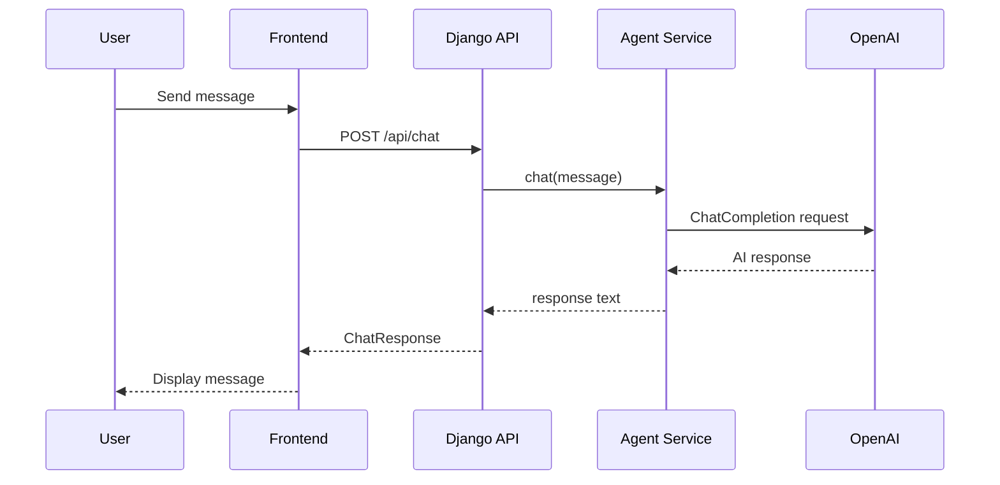
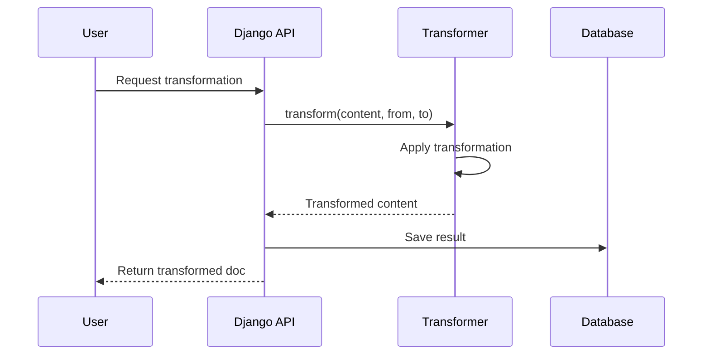

# Architecture Overview

Zoea Studio is a Django + React application built on a multi-tenant architecture with AI agent integration and knowledge management capabilities.

## High-Level Architecture

	```mermaid
	graph TB
	    User[User Browser]
	    Frontend[React Frontend<br/>Vite + React Router + Zustand]
	    API[Django Backend<br/>Django Ninja REST API]
	    DB[(SQLite/PostgreSQL)]
	    LLM[LLM Providers<br/>OpenAI/Gemini]
	    Gemini[Google Gemini<br/>File Search]

	    User --> Frontend
	    Frontend --> API
	    API --> DB
	    API --> LLM
	    API --> Gemini
	```

## System Components

### Frontend Layer
- **React 18** with StrictMode enabled for development
- **Vite** for fast development and optimized builds
- **Zustand** for lightweight state management
- **React Router** for navigation
- **Bootstrap 5** for responsive UI

### Backend Layer
- **Django 6.0** web framework
- **django-ninja** for REST API endpoints
- **django-organizations** for multi-tenant architecture
- **PostgreSQL/SQLite** for data persistence

### AI & Knowledge Layer
- **LLM provider abstraction** for AI orchestration
- **OpenAI** for chat completions and content generation
- **Google Gemini** for semantic search and RAG

### DevOps Layer
- **mise** for tool version management and task automation
- **uv** for fast Python package management
- **pytest** for backend testing (99% coverage)
- **Playwright** for E2E frontend testing

## Architecture Principles

### 1. Multi-Tenant by Design

Every resource in Zoea Studio is scoped to an **Organization**:

```python
class Project(models.Model):
    organization = models.ForeignKey(Organization, on_delete=models.CASCADE)
    # ... other fields

class Document(models.Model):
    organization = models.ForeignKey(Organization, on_delete=models.CASCADE)
    project = models.ForeignKey(Project, on_delete=models.CASCADE)
    # ... other fields
```

See the [Multi-Tenant Guide](multi-tenant.md) for detailed patterns.

### 2. Separation of Concerns

- **Models** (`models.py`) - Data structure and business logic
- **Services** (`*_service.py`) - External integrations and complex operations
- **API** (`api.py`) - HTTP request/response handling
- **Schemas** (`schemas.py`) - Request/response validation

Example:
```
chat/
├── models.py          # Conversation, Message models
├── agent_service.py   # LLM provider integration
├── graphologue_service.py # Diagram generation logic
├── api.py             # REST API endpoints
└── schemas.py         # Pydantic schemas for validation
```

### 3. Async-First for AI Operations

All AI agent interactions use async/await:

```python
service = ChatAgentService()
service.create_agent(name="assistant", instructions="...")

# Async operations
response = await service.chat("Hello")
async for chunk in service.chat_stream("Tell me a story"):
    print(chunk, end="")
```

### 4. Test-Driven Development

- **99% code coverage** on backend
- Unit tests with pytest
- Integration tests for API endpoints
- E2E tests with Playwright for critical user workflows

## Data Flow

### Chat Conversation Flow



### Document Transformation Flow



## Core Data Models

### Organization & Users

```python
Organization (Account)
  └── OrganizationUser (Membership)
      └── User (Django User)

OrganizationOwner (Special OrganizationUser)
```

### Project Hierarchy

```python
Organization
  └── Project
      └── Workspace
          ├── Documents
          ├── Conversations
          └── Clipboards
```

### Content Types

```python
Document (Base)
  ├── Image
  ├── PDF
  └── TextDocument
      ├── Markdown
      ├── Diagram (D2, React Flow)
      └── CSV
```

## API Design

Zoea Studio uses **django-ninja** for a modern, OpenAPI-compliant REST API:

### Key Features

- **Type-safe** with Pydantic schemas
- **Auto-generated** OpenAPI documentation at `/api/docs`
- **Request validation** built-in
- **Clean routing** with decorators

### Example Endpoint

```python
from ninja import Router
from .schemas import ChatRequest, ChatResponse

router = Router()

@router.post("/chat", response=ChatResponse)
def chat(request, data: ChatRequest):
    # Pydantic automatically validates input
    # ... process request
    return ChatResponse(
        response=agent_response,
        agent_name=data.agent_name
    )
```

## Security & Access Control

### Multi-Tenant Isolation

All querysets filter by organization:

```python
class DocumentQuerySet(models.QuerySet):
    def for_user(self, user):
        return self.filter(
            organization__organization_users__user=user
        )

# Usage
docs = Document.objects.for_user(request.user)
```

### Authentication

- Django session-based authentication
- Organization membership verified on every request
- Permissions checked via querysets, not view decorators

### Data Protection

- Organization-scoped database queries prevent data leakage
- CORS configured for frontend-backend communication
- Environment-based secrets management

## Scalability Considerations

### Current Architecture (Development)

- SQLite database
- Single Django process
- Local file storage

### Production-Ready Architecture

- PostgreSQL database with connection pooling
- Multiple Gunicorn workers behind nginx
- S3-compatible object storage for media
- Redis for caching and session storage
- Celery for background tasks

## Next Steps

Explore specific architectural components:

- **[Multi-Tenant Patterns](multi-tenant.md)** - Learn the critical organization-scoping patterns
- **[Frontend Architecture](frontend.md)** - React components, state management, routing
- **[Backend Architecture](backend.md)** - Models, services, API endpoints

## Key Files

| Component | Location |
|-----------|----------|
| Django settings | `backend/zoeastudio/settings.py` |
| URL routing | `backend/zoeastudio/urls.py` |
| API router | `backend/chat/api.py` |
| Agent service | `backend/chat/agent_service.py` |
| React app entry | `frontend/src/main.jsx` |
| React root | `frontend/src/App.jsx` |
| Vite config | `frontend/vite.config.js` |

## Architecture Diagrams

### Component Interaction

```d2
direction: right

frontend: Frontend {
  shape: rectangle
  style.fill: "#e3f2fd"

  ui: UI Components
  state: State (Zustand)
  router: React Router
}

backend: Backend {
  shape: rectangle
  style.fill: "#fff3e0"

  api: Django Ninja API
  services: Service Layer
  models: Django Models
}

storage: Storage {
  shape: cylinder
  style.fill: "#f3e5f5"

  db: PostgreSQL
  files: File Storage
}

external: External APIs {
  shape: cloud
  style.fill: "#e8f5e9"

  openai: OpenAI
  gemini: Google Gemini
}

frontend.ui -> backend.api: HTTP/REST
backend.api -> backend.services
backend.services -> backend.models
backend.models -> storage.db
backend.services -> external.openai: Chat Completions
backend.services -> external.gemini: File Search
backend.models -> storage.files: Documents
```

## Design Decisions

### Why Django Ninja?

- Type-safe API development with Python 3.10+ hints
- Auto-generated OpenAPI documentation
- Better performance than Django REST Framework
- Cleaner, more modern API design

### Why Zustand?

- Lightweight (compared to Redux)
- No boilerplate
- React hooks-based API
- Perfect for small to medium state management needs

### Why mise?

- Single tool for Python, Node.js version management
- Task runner alternative to Make
- Environment variable management
- Cross-platform consistency

### Why LLM Provider Abstraction?

- Supports multiple LLM backends behind a stable interface (OpenAI/Gemini/etc.)
- Keeps application code decoupled from vendor SDKs
- Centralizes config resolution per project/workspace
- Unifies streaming and error handling patterns
