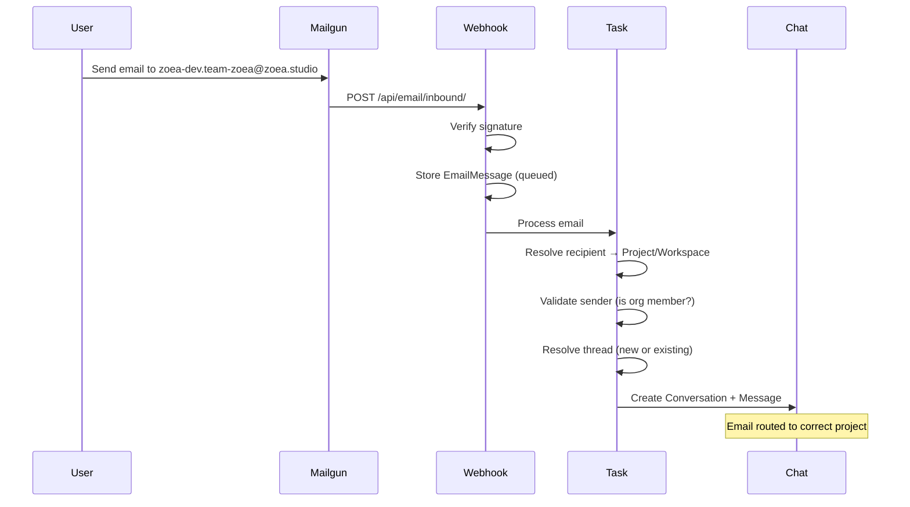

# Email Gateway

The Email Gateway allows users to interact with Zoea Collab by sending emails. Inbound emails are converted to chat conversations, enabling email-based workflows.

## Project and Workspace Email Addresses

Each project and workspace in Zoea Collab has unique email addresses that enable targeted email routing.

### Canonical Email Addresses

Canonical emails are automatically generated from slugs and are immutable once set:

| Entity | Format | Example |
|--------|--------|---------|
| **Project** | `{project-slug}.{org-slug}@zoea.studio` | `zoea-dev.team-zoea@zoea.studio` |
| **Workspace** | `{workspace-slug}.{project-slug}.{org-slug}@zoea.studio` | `research.zoea-dev.team-zoea@zoea.studio` |

The slug is auto-generated from the name when the entity is created:

- Converts to lowercase
- Replaces spaces with hyphens
- Removes special characters
- Strips accents from unicode characters

### Alias Email Addresses

Aliases are user-configurable shortcuts for easier email addresses:

| Entity | Format | Example |
|--------|--------|---------|
| **Project or Workspace** | `{alias}.{org-slug}@zoea.studio` | `bob.team-zoea@zoea.studio` |

Alias rules:

- Must start with a letter
- 2-64 characters long
- Only lowercase letters, numbers, hyphens, underscores
- Unique across all projects AND workspaces in the organization
- Set via the Project/Workspace update API

### Email Routing Logic

When an email is received, the system resolves the recipient to a project/workspace:

```
1. Try exact match on project.canonical_email
2. Try exact match on workspace.canonical_email
3. Parse email and try project.email_alias match
4. Parse email and try workspace.email_alias match
5. If no match → InvalidRecipientError
```

### API Fields

Project and Workspace API responses include email fields:

```json
{
  "id": 1,
  "name": "Zoea Dev",
  "slug": "zoea-dev",
  "canonical_email": "zoea-dev.team-zoea@zoea.studio",
  "email_alias": "dev",
  "alias_email": "dev.team-zoea@zoea.studio"
}
```

Update alias via PATCH:

```bash
curl -X PATCH https://yourdomain.com/api/projects/1 \
  -H "Content-Type: application/json" \
  -d '{"email_alias": "dev"}'
```

Set to empty string to clear: `{"email_alias": ""}`

## How It Works



### User Flow

1. **Send an email** to a project or workspace email address (e.g., `zoea-dev.team-zoea@zoea.studio`)
2. **Log into Zoea Studio** with the same email address you sent from
3. **Find your conversation** in the correct project/workspace - titled "Email: {subject}"
4. **Continue the conversation** in the chat interface

!!! note "Sender Validation"
    The sender's email must belong to a user who is a member of the same organization as the target project/workspace. Emails from unknown senders or non-members are rejected.

### Email Threading

Replies to existing email threads are automatically grouped together:

- The system uses RFC 2822 `References` and `In-Reply-To` headers
- Reply emails are added to the existing conversation
- Each email becomes a new message in the thread

## Current Limitations

!!! warning "Receive-Only"
    The current implementation is **receive-only**:

    - **No AI auto-reply** - Emails create user messages but don't trigger AI responses
    - **No outbound email** - Responses must be viewed in the web UI
    - **Manual continuation required** - Users continue conversations in the chat interface

### Visibility

Email-initiated conversations are only visible to the **sender**:

- The user who sent the email sees it in their chat list
- Other organization members do not see these conversations
- This matches the existing `created_by` filtering in the chat API

## Configuration

### Environment Variables

Add these to your `.env` file:

```bash
# Mailgun API credentials
MAILGUN_API_KEY=key-xxxxxxxxxxxxxxxxxxxxxxxxxxxxxxxx
MAILGUN_DOMAIN=mail.yourdomain.com

# Email domain for canonical/alias addresses (optional, default: zoea.studio)
ZOEA_EMAIL_DOMAIN=zoea.studio
```

The `ZOEA_EMAIL_DOMAIN` setting controls the domain used for all generated email addresses. If not set, defaults to `zoea.studio`.

### Mailgun Route Setup

1. Log into your [Mailgun Dashboard](https://app.mailgun.com/)
2. Navigate to **Receiving** → **Routes**
3. Create a new route:

| Setting | Value |
|---------|-------|
| Expression Type | Match Recipient |
| Recipient | `inbox@mail.yourdomain.com` |
| Actions | Forward to `https://yourdomain.com/api/email/inbound/` |
| Priority | 0 |

!!! tip "Development Testing"
    For local development, use a tool like [ngrok](https://ngrok.com/) to expose your local server:

    ```bash
    ngrok http 8000
    ```

    Then use the ngrok URL in your Mailgun route.

### Signature Verification

The webhook verifies Mailgun signatures using HMAC-SHA256:

- If `MAILGUN_API_KEY` is set, signatures are **required**
- If not set (development), signature verification is **skipped**
- Invalid signatures return `401 Unauthorized`

## Testing

### Using Mailgun's Test Feature

1. Go to **Sending** → **Overview** in Mailgun Dashboard
2. Click **"Send a Sample POST"** under Webhooks
3. Enter your webhook URL: `https://yourdomain.com/api/email/inbound/`
4. Check the response and server logs

### Manual Testing with curl

```bash
curl -X POST https://yourdomain.com/api/email/inbound/ \
  -d "sender=user@example.com" \
  -d "recipient=inbox@mail.yourdomain.com" \
  -d "subject=Test Email" \
  -d "body-plain=This is a test email." \
  -d "stripped-text=This is a test email." \
  -d "Message-Id=<test-123@example.com>" \
  -d "timestamp=$(date +%s)" \
  -d "token=test-token" \
  -d "signature="
```

!!! note
    This only works if `MAILGUN_API_KEY` is not set (signature verification disabled).

### Running Unit Tests

```bash
cd backend
uv run pytest email_gateway/tests/ -v
```

The test suite includes:

- **Model tests** (7) - EmailThread and EmailMessage creation
- **Service tests** (8) - Thread resolution, sender validation
- **Webhook tests** (6) - Endpoint, signatures, duplicates

## Admin Interface

The Django admin provides management interfaces for email data:

### Email Threads

- View all email threads with subject, sender, status
- See linked conversation
- Inline view of all emails in thread
- Filter by status, organization, date

### Email Messages

- View individual emails with full details
- See processing status and errors
- **Retry action** for failed emails
- Raw POST data for debugging

Access at: `/admin/email_gateway/`

## Architecture

### Models

```
EmailThread (1) ←──────→ (1) Conversation
     │
     │ (1:many)
     ▼
EmailMessage (1) ←──────→ (1) Message
```

| Model | Purpose |
|-------|---------|
| `EmailThread` | Links email thread to Conversation, stores email-specific metadata |
| `EmailMessage` | Individual email with full Mailgun data, links to Message |

### Processing Flow

1. **Webhook receives POST** from Mailgun
2. **Stores EmailMessage** with `status='queued'`
3. **Background task runs**:
   - Validates sender email → finds User
   - Gets User's organization
   - Resolves thread (existing or new)
   - Creates Conversation (if new thread)
   - Creates Message with email content
4. **Updates status** to `'processed'` or `'failed'`

### Key Files

| File | Purpose |
|------|---------|
| `email_gateway/models.py` | EmailThread, EmailMessage models |
| `email_gateway/api.py` | Webhook endpoint, signature verification |
| `email_gateway/services.py` | EmailProcessingService, validation functions |
| `email_gateway/tasks.py` | Background processing functions |
| `email_gateway/admin.py` | Admin interface |
| `projects/email_utils.py` | Email address generation, validation, and routing |

## Future Enhancements

These features are not yet implemented:

- [ ] **Automated AI replies** - Trigger Claude response and email it back
- [ ] **Attachment handling** - Store and process email attachments
- [ ] **Production task backend** - Redis/database task queue
- [x] **Project/Workspace routing** - Route emails to specific projects/workspaces ✅
- [x] **Email aliases** - User-configurable short email addresses ✅
