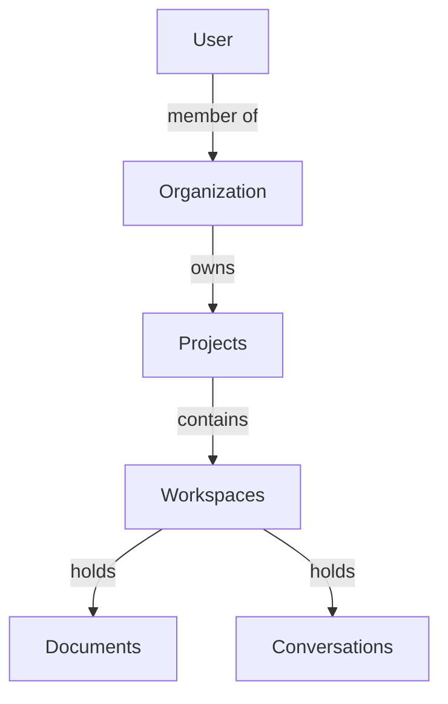

# Local User Initialization

Zoea Studio uses a multi-tenant architecture where every user belongs to an organization. This guide explains how to create your first local user, organization, project, and workspace using the `initialize_local_user` management command.

## Overview

The `initialize_local_user` command is a convenient way to set up a complete local development environment in one step. It creates:

1. **User** - Your login account (with admin privileges)
2. **Organization** - A tenant container for all resources
3. **Project** - A default project (created automatically via signals)
4. **Workspace** - A default workspace (created automatically via signals)

!!! info "Why Organizations?"
    Zoea Studio is built on django-organizations for multi-tenancy. Every resource (projects, workspaces, documents) is scoped to an organization. This enables secure multi-tenant SaaS deployments.

## Basic Usage

### Default Initialization

Run the command with default settings:

```bash
cd backend
uv run python manage.py initialize_local_user
```

This creates:

- **Username**: `admin`
- **Password**: `admin`
- **Email**: `admin@localhost`
- **Organization**: `Admin Organization` (you as the owner)
- **Project**: `Default Project` (automatically created)
- **Workspace**: `Default Workspace` (automatically created)

!!! success "Login Credentials"
    You can now log in with:
    - Username: `admin`
    - Password: `admin`

### Custom Initialization

Customize the user details with command-line options:

```bash
cd backend
uv run python manage.py initialize_local_user \
    --username yourname \
    --email your@email.com \
    --password yourpass \
    --org-name "Your Organization"
```

## Command Options

| Option | Description | Default |
|--------|-------------|---------|
| `--username` | Username for the new user | `admin` |
| `--email` | Email address | `admin@localhost` |
| `--password` | Password (use strong password for production!) | `admin` |
| `--org-name` | Organization name | `{username.title()} Organization` |
| `--subscription` | Subscription plan (free, pro, enterprise) | `free` |
| `--max-users` | Maximum users allowed | `5` |
| `--use-existing` | Use existing user if found instead of raising error | `false` |
| `--demo-docs` | Load demo documents from the demo-docs directory | `false` |
| `--demo-docs-path` | Custom path to demo documents directory | `demo-docs/` |
| `--force` | Skip confirmation prompts (for non-interactive use) | `false` |

!!! tip "Getting Started with Demo Documents"
    Use `--demo-docs` to load sample documents that demonstrate Zoea Studio's features:
    ```bash
    uv run python manage.py initialize_local_user --demo-docs
    ```

!!! warning "Security in Production"
    The default password `admin` is for local development only. **Never** use these credentials in production. Always set a strong password with `--password`.

## What Gets Created

### 1. User Account

A Django user with:

- **Superuser privileges** (can access Django admin)
- **Staff status** (can access admin interface)
- **Active status** (can log in immediately)

### 2. Organization

An Organization (via django-organizations) with:

- The user as the **owner** (highest privilege level)
- Automatic OrganizationUser relationship linking user to organization

### 3. Default Project

A Project automatically created via Django signals with:

- Name: "Default Project"
- Associated with the organization
- The user as the creator

### 4. Default Workspace

A Workspace automatically created via Django signals with:

- Name: "Default Workspace"
- Linked to the default project
- The user as the creator

### 5. Demo Documents (Optional)

When using `--demo-docs`, sample documents are loaded:

- **Markdown files** (.md) - Documentation and notes
- **D2 diagrams** (.d2) - Architecture and flow diagrams
- **Folders** - Organized structure mirroring the demo-docs directory

These demo documents help you explore Zoea Studio's document management features right away.

## Verification

After running the command, you'll see comprehensive output:

```
✅ Successfully created local development environment:

User Details:
  Username: admin
  Email: admin@localhost
  Password: ********
  Superuser: Yes
  Active: Yes

Organization Details:
  Name: Admin Organization
  Owner: admin
  Created: 2025-11-16 14:30:00

  🔗 Admin URL: http://localhost:8000/admin/organizations/organization/1/change/

Default Project:
  Name: Default Project
  Organization: Admin Organization
  Creator: admin
  Created: 2025-11-16 14:30:00

  🔗 Admin URL: http://localhost:8000/admin/documents/project/1/change/

Default Workspace:
  Name: Default Workspace
  Project: Default Project
  Creator: admin
  Created: 2025-11-16 14:30:00

  🔗 Admin URL: http://localhost:8000/admin/documents/workspace/1/change/

You can now:
  1. Log in with username: admin / password: ********
  2. Access Django admin at: http://localhost:8000/admin/
  3. Start building in your default workspace!
```

## Using Django Admin

Access the Django admin interface to manage your data:

1. Start the backend server:
   ```bash
   mise run dev-backend
   ```

2. Navigate to:
   ```
   http://localhost:8000/admin/
   ```

3. Log in with your credentials (e.g., `admin` / `admin`)

### Available Admin Sections

- **Accounts** - Manage organizations and memberships
- **Authentication** - Users and groups
- **Documents** - Projects, workspaces, and documents
- **Chat** - Conversations, messages, and agents
- **Transformations** - Content transformation jobs

## Multi-Tenant Architecture

Understanding the organization structure is crucial for development:



!!! important "Critical Pattern"
    All tenant-scoped resources **must** include an `organization` ForeignKey. See the [Multi-Tenant Guide](../architecture/multi-tenant.md) for detailed patterns and best practices.

## Adding More Users

To add additional users to your organization:

### Option 1: Django Admin (Recommended)

1. Go to `http://localhost:8000/admin/auth/user/`
2. Click "Add user"
3. Fill in username and password
4. Save
5. Go to `http://localhost:8000/admin/accounts/account/`
6. Find your organization
7. Add the user as a member

### Option 2: Django Shell

```python
cd backend
uv run python manage.py shell
```

```python
from django.contrib.auth.models import User
from accounts.models import Account

# Get the organization
org = Account.objects.get(name="Admin Organization")

# Create a new user
user = User.objects.create_user(
    username="newuser",
    email="newuser@example.com",
    password="password123"
)

# Add user to organization
org.add_user(user)
```

### Option 3: Management Command (Multiple Users)

Run `initialize_local_user` multiple times with different usernames:

```bash
# First user (owner)
uv run python manage.py initialize_local_user \
    --username alice --email alice@example.com --password pass1

# Second user (separate organization)
uv run python manage.py initialize_local_user \
    --username bob --email bob@example.com --password pass2
```

!!! note
    Each invocation creates a **new organization**. To add users to an existing organization, use Option 1 or 2.

## Resetting Your Environment

If you need to start over (development only):

```bash
cd backend

# Delete the database
rm db.sqlite3

# Recreate schema
uv run python manage.py migrate

# Initialize again
uv run python manage.py initialize_local_user
```

!!! danger "Data Loss"
    This **permanently deletes all data**. Only do this in local development!

## Next Steps

Now that you have a user and organization set up:

1. **[Run the Application](development.md#running-the-application)** - Start the servers
2. **[Learn the Architecture](../architecture/multi-tenant.md)** - Understand multi-tenant patterns
3. **[Explore the API](../development/api-reference.md)** - Test API endpoints
4. **[Start Testing](../development/testing.md)** - Write your first tests

## Troubleshooting

### Command not found

Ensure you're in the `backend` directory:

```bash
cd backend
```

And using `uv run` to execute Django commands:

```bash
uv run python manage.py initialize_local_user
```

### User already exists

If you see "User with this username already exists":

```bash
# Either use a different username
uv run python manage.py initialize_local_user --username different_name

# Or delete the existing user via Django admin first
```

### Organization already exists

If you see "Organization with this name already exists":

```bash
# Use a different organization name
uv run python manage.py initialize_local_user --org-name "Different Org Name"
```

### Can't log in to Django admin

Verify your user has superuser privileges:

```bash
cd backend
uv run python manage.py shell
```

```python
from django.contrib.auth.models import User
user = User.objects.get(username='admin')
print(f"Superuser: {user.is_superuser}, Staff: {user.is_staff}")

# If False, fix it:
user.is_superuser = True
user.is_staff = True
user.save()
```

## Command Implementation

The `initialize_local_user` command is located at:

```
backend/accounts/management/commands/initialize_local_user.py
```

It demonstrates best practices for:

- Creating users programmatically
- Setting up django-organizations relationships
- Leveraging Django signals for automatic resource creation
- Providing comprehensive user feedback

See the [Multi-Tenant Guide](../architecture/multi-tenant.md) for more implementation details.
